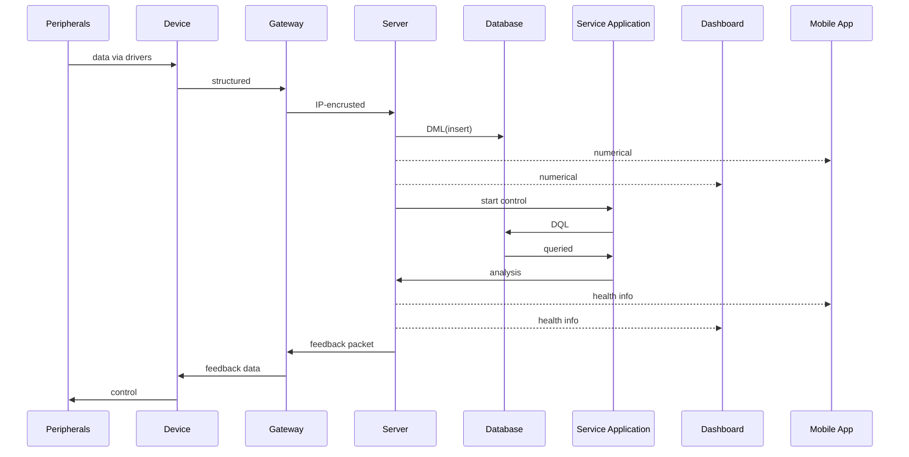
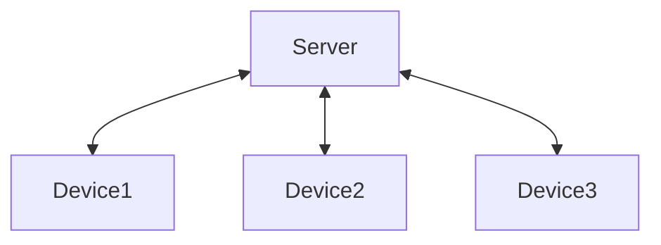
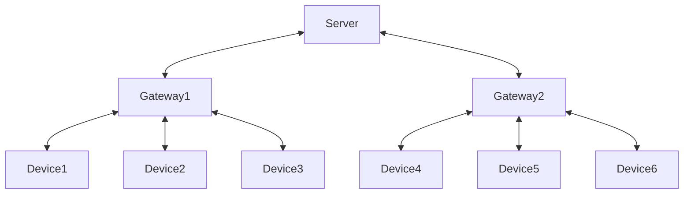
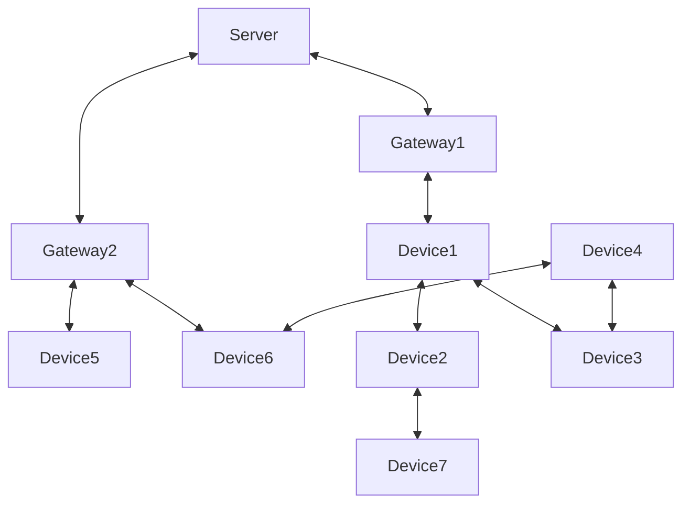

## 1. Overview

The Internet of Things (IoT) is one of those terms that you’ve probably heard before, but maybe never fully understood. Is it just about smart speakers and watches? Is it some mysterious industrial technology that only engineers in white lab coats can handle? IoT is real, and of course, it’s much bigger than just asking your fridge if you’re out of milk.

At its heart, IoT is about connecting physical objects (sensors, machines, vehicles, even toilets) to the digital world. These devices collect information about their surroundings, share it over networks, and help people and systems make better decisions. A soil moisture sensor that helps a farmer save water, a wearable that warns you before you collapse on the treadmill, or a factory machine that knows it’s about to break down before it actually does, all of these are IoT in action.

This guide exists for one simple reason: lots of people hear about IoT, but few really get it. Still, many people misunderstand IoT. Some think it’s just that smart home thing where you yell Okay Google. My goal is to lower the barrier — to explain IoT in a structured but approachable way. We’ll look at what IoT is, why it matters, and how all the pieces fit together. We’ll explore the components (end-devices, gateways, service applications, servers), the topologies that connect them, the protocols that make them talk, and the ever-important topic of security because nobody wants their smart toilets mined for cryptocurrency.

In short, IoT is about bridging the physical and digital worlds such as sensing the environment, moving data across networks, and enabling real-world actions in return. It’s about bridging the gap between the physical and digital worlds in ways that can save money, save energy, and sometimes just save you a trip to the bathroom light switch. By the end of this guide, you’ll have a much clearer understanding of how IoT works, why it matters.

---

### 1.1. Why IoT Matters

So why should anyone care about IoT?

For individuals, IoT can make everyday life more convenient, comfortable, and even healthier. Smart thermostats save energy, wearables track your fitness and health, and home sensors keep an eye on things while you’re away. Even the humble bathroom can join the party with smart toilets that analyze your anus health.

For businesses and industries, IoT is even more important. Factories use IoT to monitor machines and prevent breakdowns before they happen. Logistics companies track goods in real-time, saving both money and headaches. Farmers measure soil conditions and weather to grow more crops with fewer resources. In short, IoT helps industries run smoother, faster, and cheaper and sometimes cleaner.

For society at large, IoT has the power to make cities smarter and more sustainable. Streetlights that dim when no one’s around, traffic systems that adjust dynamically, sensors that detect pollution or flooding, all of these contribute to safer, more efficient, and greener communities.

In the end, IoT matters because it connects the physical world to the digital one in ways that create value you can see and feel. It saves time, saves money, saves energy, and occasionally saves you from having to stumble to the bathroom light switch in the middle of the night.

---

### 1.2. IoT Architecture at a Glance

IoT isn’t just about a sensor sends data, and you see it on an app. The real magic happens when devices sense the world, send information across networks, process it in servers, analyze it in the service application, and then send feedback back to the real world. That closed loop is what makes IoT powerful.

And to make this less abstract, let’s use an example everybody understands, the humble toilet upgraded to a smart toilet.

**IoT in Action - Anus Health Analysis System**



The Layers explained
 - [Peripherals](https://en.wikipedia.org/wiki/Embedded_system#Peripherals) - Physical sensors and actuators directly interacting with the environment. In the smart toilet: water level sensors, pressure sensors, heaters, flush valves, and potentially a small camera for health monitoring. These components produce raw data and execute control commands issued from higher layers.
 - Device - The embedded system or microcontroller inside the toilet. It interfaces with peripherals via device drivers, converts raw signals into structured data, and applies control commands received from the server or gateway.
   In short: the device is the translator between the physical world and digital representation.
 - Gateway - device. Without this layer, the IoT system would remain isolated.
 - Server - The central coordinator of IoT operations. It stores incoming data in the database, forwards raw metrics to dashboards and applications, and triggers the service application to perform analysis. The server can also generate feedback commands (e.g., "activate hot butt mode") that travel back down the chain.
 - Database - The persistent storage layer. It maintains historical records of all collected data: water usage, flush counts, heater activity, and more. This historical information enables both trend monitoring and comparative analysis.
 - Service application - The intelligence layer. The service application queries the database, applies algorithms, and generates insights or alerts. The service application transforms raw data into meaningful knowledge for both users and automated actions.
 - Dashboard/Mobile App - The user’s view. Shows both raw stats and insights

The architecture of IoT can look complicated at first, with many layers such as sensors, devices, gateways, servers, databases, service applications, dashboards, and applications. But in practice, each layer has a clear role like collect, process, transmit, store, analyze, visualize, and act. Together they form a closed loop that connects the physical world to the digital one and then back again.  

The smart toilet example highlights the essence of IoT like turning raw, low-level signals into meaningful insights and real-world actions. Whether it is saving water, improving health, optimizing factory machines, or managing traffic, the same layered structure applies.  

In short, IoT is not magic, it's a system of well-defined components working together to sense, decide, and respond. And once you see the loop in action, you start to understand how even the most ordinary objects can become part of something much bigger.

---

### 1.3. Misconceptions and Truths

When people think about IoT, they often fall into oversimplified or exaggerated ideas. Some see it as nothing more than tinkering with embedded boards, while others imagine it’s so complex that only big tech companies or militaries can do it. The truth is more balanced. Even the smart toilet can teach you something about it.

Misconception 1 - IoT == [Embedded Systems](https://en.wikipedia.org/wiki/Embedded_system)

It’s tempting to think IoT is just about microcontrollers and sensors.

 - Truth - IoT is much more than embedded devices. The smart toilet also needs networking to connect, a server to process, a service application to analyze, and an app to display results. IoT is a multidisciplinary system that involves hardware, firmware, networking, cloud platforms, web frontends, web backends, and user-facing software all working together.

Misconception 2 - IoT is too difficult to learn

At first glance, a smart toilet with sensors, a thermal camera, Wi-Fi, dashboards, and apps looks intimidating.

 - Truth - Getting started is easier than ever. Beginner-friendly boards like [Arduino](https://www.arduino.cc) and [ESP32](https://www.espressif.com/en/products/socs/esp32) make it simple to prototype. Free community platforms such as [The Things Network](https://www.thethingsnetwork.org), [Thinger.io](https://thinger.io), and [ThingsBoard](https://thingsboard.io) let you connect devices to the cloud and visualize data with minimal setup. You don’t need a bachelor's degree in electronics to try IoT, just curiosity and patience.

Misconception 3 - IoT == Only Smart Homes

Because the most common examples are smart fridge or smart toilets, people often assume IoT is confined to the home.  

 - Truth - The same principles apply far beyond. Farms use IoT to monitor soil and livestock, hospitals use it for patient monitoring and asset tracking, factories rely on it for predictive maintenance, and militaries deploy IoT-like sensor networks on vehicles and battlefields. The smart toilet may get the laughs, but the very same architecture runs mission-critical industries where failure isn’t an option.

Misconception 4 - IoT is just about collecting data

If the smart toilet only counted flushes and sent numbers to the cloud, it would be little more than a gimmick.

 - Truth - IoT is about the feedback loop that sensing, analyzing, and acting. A smart toilet can lower flush volume to save water, adjust heater use for efficiency, or notify users about potential health issues. Similarly, an industrial IoT system might shut down an overheating motor before it fails, and a military drone swarm might re-route itself if one unit is jammed. IoT’s power lies not in numbers, but in closing the loop between data and action.

---

## 2. IoT components

Every IoT system, no matter how simple or complex, can be broken down into a few essential building blocks. You can think of these as the four pillars that hold the entire structure together such as End-Devices, Gateways, Service Applications, and Servers. Each plays a unique role, and together they create the closed loop that makes IoT valuable.

 - End-Devices are the eyes, ears, and hands of IoT. They sense the environment through sensors, act on it through actuators, and run lightweight applications to process data locally. From a temperature sensor to a smart toilet with a pressure valve and a bidet nozzle that targets with sniper-like precision. These are all end-devices.

 - Gateways are the bridge between the local world of devices and the larger network. They collect structured data from multiple end-devices, wrap it into network-friendly formats like IP packets, and ship it off to the server. A LoRaWAN gateway such as the RAK7268 is a good example. It gathers signals from many nodes and ensures they reach the right destination.  

 - Service Applications are the problem solver. While servers and databases handle storage and routing, The service application digs into the data, queries it, analyzes it, and extracts meaning. Without it, your system would just be a pile of numbers. With it, those numbers turn into actionable insights, like a smart toilet saying like "Blood detected in your dump - reduce late night buldak". The service application can live on the device, at the gateway, or in the cloud, depending on the complexity.

 - Servers are the central coordinators of IoT operations. They ingest data (via HTTP, MQTT, or other protocols), store it in databases, and forward it to dashboards, service applications, or mobile apps. They also send commands back down to gateways and devices. Without the server, your IoT system is just a bunch of disconnected chatter with no one listening.

Together, these components form the IoT loop. devices generate data -> gateways transport it -> servers and service applications process it -> insights or commands flow back to the real world. This loop is what transforms IoT from a collection of sensors into a living, responsive system.

---

### 2.1. End-Device

The end-device is the first soldier on the IoT battlefield, the one that directly touches the physical world. It senses, acts, and communicates. Without it, your IoT system is like a server staring into the void, waiting for data that never comes.

At the core of most end-devices is a [microcontroller (MCU)](https://en.wikipedia.org/wiki/Microcontroller). An MCU is a compact SoC that includes CPU, memory, timers, and peripheral interfaces ([GPIO](https://en.wikipedia.org/wiki/General-purpose_input/output), [UART](https://en.wikipedia.org/wiki/Universal_asynchronous_receiver-transmitter), [I²C](https://en.wikipedia.org/wiki/I%C2%B2C), [SPI](https://en.wikipedia.org/wiki/Serial_Peripheral_Interface), [ADC](https://en.wikipedia.org/wiki/Analog-to-digital_converter)/[DAC](https://en.wikipedia.org/wiki/Digital-to-analog_converter), [PWM](https://en.wikipedia.org/wiki/Pulse-width_modulation)) all baked into a single chip. This makes it cheap, low-power, and durable enough to run for years on a battery. For example, [RAK](https://rakwireless.com)’s **[RAK3172](https://www.rakwireless.com/en-us/products/lpwan-modules/rak3172-wisduo-lpwan-module)** is a perfect ultra-low-power LoRaWAN module.

Because MCUs have limited resources, they don’t run Windows 11 or macOS like your laptop. Instead, they rely on [RTOS (Real-Time Operating Systems)](https://en.wikipedia.org/wiki/Real-time_operating_system) such as [Zephyr](https://www.zephyrproject.org) or [NuttX](https://nuttx.apache.org). An RTOS is lightweight, predictable, and built to handle precise timing. Imagine a smart toilet seat heater: it must activate the instant you sit, not whenever the scheduler gets around to it. That’s why IoT engineers prefer RTOS over general-purpose OSes.

Not all end-devices are tiny, battery-powered nodes. Some applications demand more horsepower like real-time image recognition, video streaming, or complex local analytics. In these cases, end-devices are built on high-performance SoCs (System-on-Chip) such as [Rockchip's RK3588](https://www.rock-chips.com/a/en/products/RK35_Series/2022/0926/1660.html) capable of running [embedded Linux distributions](https://en.wikipedia.org/wiki/Linux_on_embedded_systems) such as [Buildroot](https://buildroot.org), [Yocto](https://www.yoctoproject.org), or [OpenWrt](https://openwrt.org). Think of a smart toilet with a built-in AI camera that scans for health anomalies: an MCU alone isn’t enough, but a Linux-capable SoC can handle that heavy lifting. These Linux-based end-devices blur the line between device and mini workstation, giving developers far more flexibility at the cost of higher power consumption.

A critical challenge comes after firmware deployment is firmware updates. Once a device is sealed inside a toilet tank, strapped to a lamp post, or buried in soil, you don’t want to send an engineer with a USB cable every time a bug is fixed. This is where FUOTA (Firmware Update Over-The-Air) saves the day. With FUOTA, updates are delivered wirelessly and securely. Without it, maintenance costs skyrocket, often exceeding the device’s own cost. With it, even a thousand smart toilets in public restrooms can get bug fixes overnight so no plumber required.

From a developer’s perspective, building an end-device usually begins with a development board. This makes prototyping easier by exposing pins and handling power and antennas. RAK’s [WisBlock ecosystem](https://www.rakwireless.com/en-us/products/wisblock) is a great example: you can snap in sensor blocks (temperature, CO₂, even cameras), communication blocks (LoRa, LTE, WiFi), and power blocks like Lego. Firmware can be written in Arduino or PlatformIO for quick starts, or in Zephyr RTOS or NuttX RTOS for serious projects.

Communication with peripherals happens through [device drivers](https://en.wikipedia.org/wiki/Device_driver). These drivers translate raw signals into structured data. For instance:
 - A pressure sensor’s raw ADC values become toilet tank guage.
 - GPIO level 0 means trigger flush valve.

In short, the end-device is where the IoT story begins. It is the toilet seat that knows when to warm up, the flush valve that receives commands, the camera that checks your health, and the MCU or SoC that makes sense of it all. With MCUs, RTOS, Linux-capable SoCs, and FUOTA, end-devices have become not just sensors, but intelligent, maintainable, and upgradeable building blocks of IoT.

---

### 2.2. Gateway

If the end-device is the one doing the dirty work, literally, the gateway is the trusted courier that ensures all those intimate details don’t stay stuck in the bathroom but actually reach the server.

A gateway’s fundamental job is to bridge two very different worlds
- On the device side, it transceives low-power, short-range protocols such as LoRaWAN, BLE, Thread, or [proprietary radios](https://en.wikipedia.org/wiki/ISM_radio_band).
- On the network side, it transceives the internet protocol packets such as MQTT, HTTP, or gRPC.

In our smart toilet example, the end-device reports "Seat occupied, 5°C" via Thread. A nearby indoor gateway catches the packet, wraps it in an IP envelope, and sends it to the server. Later, when the server decides "Switch to hot butt mode", the gateway delivers the command back down to the smart toilet. Without this post office in the middle, you’d have just an ice cold seat despite the smart toilet.

But gateways aren’t always standalone boxes. Sometimes, the line blurs
 - A powerful end-device can also act as a gateway, running both its own application logic and forwarding other devices’ traffic.
 - Conversely, a gateway can double as an end-device, running local applications or controlling actuators directly.  

This overlap is especially common in smaller or experimental setups. Your smart toilet prototype might have a single board computer doing everything like sensing, controlling the flush, and uploading data to the server. That’s both end-device and gateway in one.

Gateways also often handle extra responsibilities
 - Aggregation - combining multiple device messages before sending them uplink.
 - Security - authenticating devices, encrypting payloads, or filtering invalid packets.
 - Edge processing - doing some analysis locally (like checking if your flush frequency is abnormally high after Taco Tuesday) instead of waiting for the cloud.
 - Buffering - holding data temporarily if the internet connection drops — because nobody wants their flush logs to vanish into thin air.
 - Health & Maintenance - monitoring its own status (CPU load, temperature, storage, connectivity) and sometimes even the status of end-devices, so admins know when a reboot or update is needed before things break down.

In short, the gateway is the post office of IoT. It sorts, stamps, and delivers every message, ensuring the loop between the physical and digital worlds stays unbroken and that even your bathroom stays smart without buffering.  

---

### 2.3. Server

If the end-device is the soldier on the battlefield and the gateway is the courier, the server is the command center.  
It is the central coordinator of IoT operations such as collecting data, storing it, passing it to the service application for analysis, diagnosing device health, and then sending back instructions. Without the server, your IoT deployment would be like an army with no headquarters. lots of activity but no strategy.

The server’s first responsibility is data ingestion. It receives messages from gateways using application-level protocols such as HTTP, MQTT, or gRPC.
 - HTTP is simple request–response, the same your web browser uses.
 - MQTT is the superstar of IoT. lightweight, pub/sub style, and perfect for constrained devices. For example, a smart toilet could publish `toilet/seat/temp` updates, and apps or dashboards subscribed to that topic would instantly get the data.  
 - gRPC or WebSockets are sometimes used for advanced streaming or two-way communication.

Next comes storage. Raw numbers would be meaningless if they vanished after a second. That’s why IoT servers almost always pair with a database, often optimized for time-series queries
 - How many liters of water were flushed this week?
 - Did flush frequency spike after a late-night buldak or malatang level 4?

The server also acts as the traffic controller. It decides what goes where. triggering service applications for analysis, updating dashboards with the latest values, or pushing alerts to a mobile app.  

But beyond this, the server is also the health inspector of the IoT system. By monitoring incoming data patterns, heartbeat signals, and error reports, the server can detect when a device is failing or misbehaving
 - This toilet hasn’t reported in 12 hours -> possible connectivity loss.
 - Unusual packet drops detected -> antenna or radio module may be failing.
 - Battery voltage dropping fast -> maintenance required soon.

Finally, the server takes the role of command and control, sending instructions back down the chain
 - Switch to hot butt mode.
 - Update firmware at 05:00.
 - Run built-in test now.

Consider our smart toilet again
 - The device reports seat temperature, flush count, and water usage.
 - The gateway forwards the data.
 - The server receives and logs it, updates the dashboard, and triggers service applications.
 - The service application analyzes and replies - Possible hemorrhoids -> increase fiber intake.
 - The server not only sends this to the app, but also keeps an eye on the toilet’s own health - Bidet pump current draw too high -> likely to fail soon.
 - If needed, the server commands the device - Reduce heater load to prevent damage.  

Servers come in different forms. Some are dedicated IoT platforms such as ChirpStack, ThingsBoard, or The Things Network. Others are cloud services like AWS IoT Core or Azure IoT Hub, which scale globally but cost money and create lock-in. And some deployments rely on custom servers built with Node.js, Python, or Go, usually paired with an MQTT broker like [Mosquitto](https://mosquitto.org) for flexibility.  

In the end, the server is the brain and backbone of IoT. It ties everything together, devices, gateways, databases, service applications, and web/mobile applications. It doesn’t just store data; it ensures the system is healthy, responsive, and trustworthy. Without it, your smart toilet may measure and transmit everything, but you’d never know when it’s about to break. With it, you’ll not only get a warm seat, but also a warning before the flush pump dies on you especially after a night of buldak.

---

### 2.4. Service Application

The service application is the problem solver in an IoT system. It consumes the data that devices and gateways collect, understands it in context, and generates insights that drive real actions. Without it, you have numbers, with it, you have decisions, recommendations, alerts, and control signals that actually solve problems in the real world.

Think of the smart toilet again, the device streams seat temperature, water flow, and camera features. The service application doesn’t merely relay those values, it infers "abnormal usage pattern after late-night buldaks" recommends "increase hydration" and commands "stronger bidet water pressure for stinging anus" That is insight generation: transforming signals into outcomes.

How the service application thinks (conceptually)
 - Data -> Context - attach who/where/when, unit normalization, quality checks.
 - Context -> Features - rolling stats, baselines, deltas, trend and seasonality, anomaly scores.
 - Features -> Insight - rules engines and/or ML models (classification, anomaly detection, forecasting).
 - Insight -> Action - human-readable advice, app notifications, tickets, or closed-loop control back to devices.
 - Action -> Feedback - verify the effect, update baselines, keep learning.

Concrete problems service applications solve
 - Personal/consumer - Flush frequency up 40% this week -> send tip, adjust bidet temp profile.
 - Industrial - Vibration spectrum shift on Pump #12 -> schedule maintenance (predictive).
 - City/utility - District flow vs. meter sum mismatch -> leak suspected in Zone C.
 - Agriculture - Soil moisture and evapotranspiration forecast -> irrigate 6 am only, 20% less water.

Where it runs (only as needed, function stays the same)
 - On device (edge-lite) - quick thresholds and simple models to cut latency and bandwidth.
 - On gateway (edge) - aggregate across many nodes, filter noise, buffer when backhaul drops.
 - On server (cloud/on-prem) - heavy analytics, long history, model training, fleet-wide optimization.

What good service applications produce
 - Insights - clear, explainable statements.
 - Recommendations - next best actions.
 - Control outputs - tuned setpoints, profiles.

In short, service applications create meaning and closes the loop. Devices sense, servers store, the service applications decide, so the system can act, improve, and prove its value.

---

## 3. Network Topologies

In IoT, how devices connect to each other and to the wider internet is just as important as the devices themselves. You can have the smartest sensor in the world, but if its data never leaves the bathroom, it’s basically just an expensive dumbass. The network topology, the arrangement of connections between end-devices, gateways, and servers, defines how information flows, how resilient the system is, and how easy it is to scale.

There isn’t a single best topology. Instead, IoT systems typically fall into a few broad patterns depending on the use case, cost constraints, and reliability requirements. At a high level, we can say that IoT networks are usually built around three main topologies. Each comes with its own strengths and weaknesses, and in practice, many real-world deployments mix them together for balance.

In the following sections, we’ll explore these three
 - Direct connection (the simplest form, device-to-server)
 - Hierarchical connection (a tree-like structure with gateways)
 - Mesh network (devices helping each other relay data)

And yes, even our running example, the smart toilet can be explained with each of these topologies. Whether it’s a single home toilet connecting via WiFi, a building full of restrooms connected in tiers, or a festival ground where toilets form a mesh of their own, the topology shapes the way the data travels from butt to cloud.  

---

### 3.1. Direct connection

The most straightforward topology in IoT is the direct connection. Here, end-devices send data straight to the server over an IP network, no gateway, no middleman, just a direct line from the device to the server.



Picture our smart toilet again. With Wi-Fi built in, it doesn’t bother whispering to a nearby gateway. Instead, it uploads data directly. seat temperature logs, water usage, and even the health camera’s latest warning (bleeding detected, avoid buldak for a week). Everything goes straight to the cloud, no stops along the way.

This topology feels clean and simple, which is why many consumer IoT devices start here. Examples include
 - Smart plugs that report electricity usage directly to a cloud dashboard.
 - Wi-Fi security cameras that livestream straight to your phone app without a hub.
 - Smart toilets that send your butt analytics directly to your healthcare app.

But while direct connection is easy, it comes with clear trade-offs
- Power drain - Wi-Fi and LTE eat batteries alive, making this unsuitable for tiny sensors expected to last years.
- Server overload - If thousands of devices all talk directly to the same server, the cloud can choke under the load.
- Coverage gaps - Wi-Fi has limited range and LTE doesn’t work everywhere. A smart toilet in a basement or rural outhouse may lose connection and revert to being just a dumb toilet.

Recently, technologies like [IEEE 802.11ah (Wi-Fi HaLow)](https://en.wikipedia.org/wiki/IEEE_802.11ah) have been developed to address the 3rd problem. Wi-Fi HaLow operates in sub-GHz frequencies, offering far better coverage and lower power consumption, making it suitable for industrial IoT devices or smart infrastructure where traditional Wi-Fi falls short. In other words, the future promises fewer toilet offline errors.

In short, direct connection is the plug-and-play of IoT topologies. It’s excellent for small-scale deployments, consumer gadgets, or early prototypes. But as soon as you scale, its weaknesses appear which is why more complex topologies like hierarchical connections or mesh networks are needed.

---

### 3.2. Hierarchical Connection

If direct connection is the simplest form of IoT, the hierarchical connection is the one that most people actually encounter in real deployments. Instead of every device shouting directly at the server, they speak quietly to a gateway, which then forwards everything uplink.



Back to our smart toilet. Instead of embedding Wi-Fi in every seat, each toilet might use a low-power protocol like BLE or LoRa to send data to a nearby gateway in the building. That gateway aggregates the packets and uploads them via MQTT or HTTP to the cloud. When the server decides "Activate hot butt boost" or "Trigger deodorizer spray", the command flows down the hierarchy, server -> gateway -> toilet.  

This approach is everywhere in IoT
 - LoRaWAN networks - sensors like water meters or soil monitors connect to concentrator gateways, which forward data to a network server.
 - BLE-based health devices - wearables report to a smartphone acting as a gateway, which then relays data to the server.
 - Industrial IoT setups - factory machines send data over wired or short-range radios to local gateways, which connect securely to remote servers.

Advantages
 - Energy efficiency - Devices can run on tiny batteries for years since they don’t need high-power radios.  
 - Scalability - A single gateway can handle over hundreds devices.  
 - Flexibility - Gateways can preprocess or filter data before sending it on, reducing cloud workload.  
 - Resilience - Gateways can cache data when internet is down, then upload once the link is restored.  

Disadvantages
 - Single point of failure - If the gateway goes offline, all connected devices are silenced.
 - Complexity - More moving parts mean more setup, configuration, and maintenance.
 - Latency - The extra hop can add delay, which may be problematic for time-sensitive systems.

In short, hierarchical connection is the workhorse topology of IoT. It’s efficient, scalable, and well-suited for large deployments — whether that’s a farm full of soil sensors, a factory floor, or yes, even an airport bathroom with hundreds of smart toilets all flushing data through one gateway.  

---

### 3.3. Mesh Network

In a mesh network, devices don’t just talk to a gateway, they also talk to each other. Every node can forward messages, extending the network’s coverage and resilience. Instead of one central courier, you now have an entire neighborhood where each house can pass along the mail.  



Imagine a row of smart toilets in a public restroom. One toilet detects that water pressure is dropping. It passes this warning to the next toilet, which relays it to the next, until eventually the gateway (or server) gets the message. Even if one toilet goes offline (maybe it’s under maintenance), the others can still forward the data around it. That’s the power of mesh.  

This topology is used in many real-world IoT systems
 - Zigbee smart bulbs - if one bulb is too far from the hub, another bulb in the middle relays the message.
 - Thread-based networks - devices form a mesh where Thread Routers forward data internally, and a Border Router bridges the mesh to the wider internet.
 - LoRaWAN in experimental multi-hop modes - while LoRaWAN is typically star-topology, some research and deployments use nodes as relays to extend coverage, effectively creating a lightweight mesh.
 - Industrial sensor networks - hundreds of nodes in a warehouse pass messages along until they reach the gateway.

Advantages
 - Extended range - Nodes can cover larger areas by relaying messages, even if each individual link is short-range.  
 - Resilience - If one node fails, traffic can reroute through others.  
 - Scalability - Easy to add more nodes. the network grows stronger as it grows larger.  

Disadvantages
 - Complexity - Routing and message forwarding logic add overhead.  
 - Latency - Data may need to hop through multiple nodes before reaching the gateway, introducing delay.  
 - Power usage - Nodes that forward traffic for others may consume more energy.  

In many ways, a mesh network is already a hybrid topology. Some nodes may talk directly to the server, others forward through neighbors, and still others rely on gateways or border routers. This blend makes mesh both highly flexible and sometimes overly complex.

In short, mesh networks shine when you need wide coverage, resilience, and scalability. That’s why they’re popular in smart homes, industrial warehouses, and experimental long-range deployments. And yes, even in bathrooms. a toilet mesh ensures that if one unit goes down, the rest can still keep the data flowing.

As we’ve seen, IoT networks can be wired together in several ways. each with its own flavor, benefits, and headaches.  

 - Direct connection keeps things simple, device -> server, no middleman. It’s easy for prototypes or consumer gadgets but hits limits fast with power, coverage, and scale.  
 - Hierarchical connection introduces gateways as middle managers, aggregating and forwarding data. This makes deployments far more scalable and efficient, but also adds a single point of failure.  
 - Mesh networks spread the work across all devices, letting them forward each other’s messages. This extends range and resilience but brings complexity and higher energy costs for nodes doing extra forwarding.  

In reality, no deployment sticks perfectly to one model. A city-wide smart metering system might use LoRaWAN in a hierarchical star-of-stars, while homes use Thread or Zigbee mesh, and consumer devices still rely on direct Wi-Fi connections. Often, all of these coexist within the same ecosystem.  

So what’s the best topology? The unsatisfying but true answer is it depends. The right choice comes down to trade-offs like power budgets, coverage requirements, cost constraints, and reliability expectations.  

Even the smart toilet example proves the point
 - A home toilet may connect directly via Wi-Fi.
 - An airport restroom may use BLE-to-gateway hierarchical setups.
 - A festival ground full of portable toilets may form a mesh so the system still works if one goes offline.

At the end of the day, IoT topology is about making sure the data doesn’t just swirl around in the bowl but actually makes it to the server, where it can be stored, analyzed, and turned into useful actions.

---

## 4. Some Non-IP Connection Technologies

Not every IoT device connects to the internet with IP packets right away as you learned from the previous chapters. In fact, much of the communication in IoT happens through non-IP technologies, protocols and buses that were never designed to speak directly to the web, but still carry critical signals between sensors, controllers, and gateways. These links are often cheaper, lower power, or more reliable in noisy industrial environments. Think of them as the local dialects of IoT, which the gateway later translates into the global language of IP.

We’ll split them into two main families, wired and wireless.

---

### 4.1. Wired

Despite the hype around wireless, wired connections are still everywhere in IoT, especially in factories, vehicles, and heavy machinery. Wired links are usually more reliable, immune to interference, and sometimes cheaper for short distances.

---

#### 4.1.1. UART (and RS-232 / RS-485)

When people say serial communication, they often mean different things, sometimes UART, sometimes RS-232, sometimes RS-485. Let’s clear this up.

A [UART (Universal Asynchronous Receiver/Transmitter)](https://en.wikipedia.org/wiki/Universal_asynchronous_receiver-transmitter) is a hardware block inside an MCU or SoC that takes parallel data (bytes) from memory and shifts them out bit by bit over a single wire (TX), while receiving on another wire (RX). This is the foundation of classic serial communication. But UART signals by themselves are just logic-level voltages (e.g., 3.3V or 5V).

To send them over longer distances or connect to legacy equipment, standards like RS-232 and RS-485 were created. RS-232 defines voltage swings around ±3 V to ±15 V, idle negative, and is usually point-to-point. That’s why you needed a DB-9 connector and a chip like MAX3232 to connect a PC’s COM port. RS-485, on the other hand, uses differential signaling (A/B pair) for robustness, supports multi-drop (many devices on one bus), and can run hundreds of meters. It’s still the backbone of industrial networks, often carrying Modbus RTU or other custom protocols.

There are also a number of common misconceptions
 - Serial == RS-232 - This is wrong. Serial is just a concept (bits in a row). RS-232 is one electrical standard for serial.
 - My MCU has RS-232 pins - Wrong again. MCUs only have UART pins at logic levels. You need a level shifter to get true RS-232.
 - RS-485 is a protocol - Incorrect. RS-485 only defines the physical layer. Higher-level protocols like Modbus RTU or DMX512 ride on top of it.
 - All serial buses are the same - Not at all. SPI, I²C, and USB are also serial, but they’re synchronous or packet-based, not UART-style asynchronous links.

For IoT, this distinction is critical. Many gateways still expose UART/RS-485 ports because factories, power plants, and building automation rely on them. A modern IoT setup might look like this, smart sensor -> UART -> RS-485 transceiver -> twisted-pair cable -> gateway -> MQTT to the server. That way, even a decades-old Modbus water meter can become part of a modern dashboard. And yes, even a smart toilet on a noisy factory floor could be reporting "tank full" via RS-485. sometimes the old ways are still the most reliable.

---

#### 4.1.2. CAN (Controller Area Network)

The Controller Area Network (CAN) was originally developed by Bosch in the 1980s for vehicles, and today it is the nervous system of every modern car. Unlike UART or RS-232/485, which are more point-to-point, CAN was designed from the start to let many devices share the same bus without chaos. Every node can put messages on the line, and arbitration ensures the highest-priority message always gets through first.

What makes CAN powerful is its robustness. It’s resistant to electrical noise, supports error detection and retransmission, and CAN work reliably in harsh environments. This is why automotive systems from engine control units to airbags rely on it. Robots, factory machines, and even medical devices also use CAN because failure is not an option.

Some key characteristics of CAN include:  
 - Multi-master bus - any node CAN initiate communication, not just a central master.  
 - Message-based - devices identify frames by ID, not by node address. This allows flexible system design.  
 - Error handling - built-in mechanisms CAN detect faults, retry messages, and even isolate malfunctioning nodes.  

For IoT, CAN is valuable because it provides a rugged way to link multiple microcontrollers or sensors without needing heavy infrastructure. Gateways can easily translate CAN frames into MQTT, HTTP, or another IP-based protocol for the cloud. In an industrial plant, dozens of machines might report operational data over CAN, with a single IoT gateway bridging them to the internet. In other words, with CAN, a lot of things become truly CAN-do possible.

A concrete example can be found in camping trailers. Modern trailers CAN use CAN to coordinate subsystems like lighting, battery management, and HVAC. The bathroom module including the smart toilet CAN be another node on the CAN bus. The toilet’s controller might report water tank levels, seat heating status, or flush cycles onto the network. Other nodes, like the central control panel or energy management system, CAN then react limiting flushes when the water tank is nearly empty, or shutting off the seat heater when battery levels are low.

In fact, the RV industry has standardized this with [RV-C (Recreational Vehicle–Communication)](https://en.wikipedia.org/wiki/RV-C), which is essentially CAN with higher-level protocols tailored for trailers and motorhomes. RV-C defines how appliances, power systems, climate controls, and even entertainment units communicate over a shared CAN bus. For IoT engineers, this means an RV can be treated like a mini smart home on wheels, where the toilet, fridge, heater, and battery monitor all speak the same language. Truly, with CAN, the RV CAN function as a unified system.

---

### 4.2. Wireless

Wireless gets all the attention in IoT because it enables the vision of tiny devices scattered everywhere, running on batteries, and talking to the cloud. But not all wireless is IP-based. Many IoT devices speak through radios that trade speed for low power, long range, or specialized use cases.

---

#### 4.2.1. IEEE 802.11

When people say Wi-Fi, they usually mean IEEE 802.11, the family of standards that define how wireless LANs work. From the early 802.11b crawling along at 11 Mbps in the 2.4 GHz band, to modern 802.11ax (Wi-Fi 6/6E) pushing gigabits across multiple bands, the rulebook has evolved, but the idea is the same, devices can exchange IP packets wirelessly. In short, IEEE 802.11 is the standard, while Wi-Fi is the friendly logo on your router box.

But IEEE 802.11 isn’t monolithic. It can operate in different modes, and these matter for IoT
- Infrastructure mode
  Devices connect to an Access Point (AP), like your home Wi-Fi router, which bridges to the internet. For IoT, this is the most common setup — a smart plug or smart toilet just joins the house Wi-Fi and starts uploading data.
- Ad-hoc mode  
  Devices connect directly without an AP. This creates a peer-to-peer network. Rare in consumer products, but occasionally useful for pop-up IoT deployments (like an RV campground where toilets "talk" to each other without central infrastructure).
- Wi-Fi Direct  
  A more modern peer-to-peer setup. Two devices form a direct, secure link without a router. In IoT, this is handy for onboarding. when you first buy a smart toilet, your phone app might connect via Wi-Fi Direct to set Wi-Fi credentials, update firmware, or run diagnostics. It’s like a private setup lane before the toilet joins your home network.

Here’s where confusion often arises, a Wi-Fi router is not an IoT gateway.

 - A Wi-Fi router is a traffic forwarder. It assumes every device already speaks IP, and it simply moves packets along, without caring what they mean.
 - An IoT gateway is a translator and coordinator. It can take non-IP protocols like LoRaWAN, BLE, Thread, or CAN, wrap them in IP, add authentication, encrypt messages, preprocess data, buffer it if the uplink is down, and finally forward it to an application server.

So, while your Wi-Fi router is basically a hallway monitor making sure kids have hall passes, the IoT gateway is more like a multilingual translator, security guard, and courier rolled into one. They might both move traffic, but their jobs are fundamentally different.

IoT Use Cases with IEEE 802.11
 - Consumer gadgets - Smart bulbs, Wi-Fi cameras, or smart toilets using infrastructure mode to send data straight to the cloud.  
 - Setup flows - Smart toilets connecting to a phone via Wi-Fi Direct before joining the main network.  
 - Industrial IoT - Wi-Fi HaLow (802.11ah) extends range into the hundreds of meters while lowering power consumption. This solves problems like "toilets in the basement lose Wi-Fi signal," or sensor networks spread across warehouses and farms.  

In the bathroom context, this means your smart toilet won’t panic every time the Wi-Fi signal wavers. With the right mode and standard, it can pair smoothly with your phone, keep logging health stats in the cloud, and stay connected even in the far corners of a building. In the end, IEEE 802.11 makes sure that whether it’s water usage, seat temperature, or the less glamorous analytics, the data always finds its way out of the bathroom and into the digital world where it can actually be useful.

---

#### 4.2.2. Bluetooth / BLE

When most people hear Bluetooth, they think of wireless headphones, car stereos, or the endless struggle of pairing that one stubborn device. But in IoT, the real star isn’t "classic" Bluetooth. It’s Bluetooth Low Energy (BLE).  

BLE was designed for exactly the kinds of devices IoT thrives on: tiny sensors and actuators that need to run for months or even years on coin-cell batteries. Unlike classic Bluetooth, which streams audio continuously and burns power, BLE focuses on short, efficient bursts of data, perfect for a heart-rate monitor, a fitness tracker, or even a smart toilet keeping track of how hydrated you are.

Another key difference is the roles BLE devices can take
- Peripheral - Small, simple devices that collect or send a bit of data (like a temperature sensor or a seat-occupancy sensor).
- Central - More powerful devices (like smartphones or PCs) that connect to many peripherals, query them, and forward data to the cloud.

In practice, this often means your phone doubles as a gateway. For example, your BLE-based smartwatch reports your heart rate to your phone, which then uploads it to the server. Similarly, a BLE-enabled smart toilet in an RV bathroom could sync its data to a nearby phone via BLE, and the phone would then act as the courier to the cloud.  

BLE also supports Bluetooth Mesh, which allows devices to forward messages for each other. This turns a group of nodes such as smart light bulbs, thermostats, or even toilets in a public building into a resilient network where data can hop across devices until it reaches a gateway.  

Strengths of BLE in IoT
 - Ultra-low power consumption.  
 - Ubiquitous support in smartphones (instant gateway).  
 - Flexible topologies, from simple peripheral–central links to full-blown mesh networks.  

Weaknesses
 - Limited range compared to Wi-Fi or LoRa (tens of meters indoors).
 - Not ideal for high-bandwidth applications (forget about streaming toilet-seat-cam video over BLE).
 - Requires a gateway device (usually a phone or hub) to reach the wider internet.

In short, Bluetooth/BLE is one of the quiet workhorses of IoT. It keeps wearables alive on tiny batteries, lets devices piggyback on smartphones as gateways, and even forms self-healing meshes when needed. And whether it’s syncing your fitness tracker or uploading hydration data from a smart toilet in your RV, BLE proves that sometimes small, short conversations can carry big value.

---

#### 4.2.3. LoRa

If Wi-Fi is about speed and Bluetooth is about convenience, LoRa (Long Range) is about endurance.  
LoRa is a wireless modulation technique that uses CSS (Chirp Spread Spectrum) to send small packets of data across very long distances (several kilometers in rural areas, sometimes even beyond 10 km) while consuming extremely little power. That’s why LoRa is often the choice for sensors expected to last years on a single battery.

It’s important to note that LoRa itself is not a full network protocol.
LoRa is only the physical layer, the radio language that devices use to modulate signals. What people often confuse with LoRa is LoRaWAN, which defines the network and application protocols on top of LoRa. We’ll cover LoRaWAN later in the Application Protocols section. For now, just remember, LoRa is how you shout across a valley, LoRaWAN is the rules of the conversation.

Because of its long range and low power profile, LoRa is widely used in scenarios where Wi-Fi or Bluetooth simply can’t reach
 - Smart farming - Soil moisture or weather sensors spread across wide farmland.
 - Smart cities - Streetlights, air-quality monitors, or trash bins reporting status across entire districts.
 - Utility metering - Water, gas, or electricity meters sending daily usage updates from basements.
 - Smart sanitation - Even a smart toilet in the underground floor of a shopping mall can report water usage and maintenance alerts without ever touching Wi-Fi.

Strengths of LoRa
 - Long-distance coverage in open areas.
 - Very low power consumption.
 - Operates in unlicensed ISM bands (e.g., 868 MHz EU, 915 MHz US, 920 MHz KR).
 - Inexpensive hardware and community support.

Limitations
 - Very low data rate (on the order of kbps). Forget about high-bandwidth use cases.
 - Limited payload size (often less than a few dozen bytes per packet).
 - Duty-cycle restrictions in ISM bands (devices can’t transmit all the time).
 - Needs proper gateway placement to ensure coverage.

In short, LoRa is the marathon runner of wireless tech that is not fast, not flashy, but steady, power-efficient, and capable of carrying your IoT data across distances where other radios give up. Even in places as hidden as a basement restroom, LoRa makes sure the data doesn’t stay stuck underground.

---

#### 4.2.4. IEEE 802.15.4

If Wi-Fi is the heavyweight sprinter and LoRa is the patient marathon runner, IEEE 802.15.4 is more like a skilled middle-distance runner. Built for balance like low power, moderate range, and the ability to support large networks of small devices.  

IEEE 802.15.4 itself only defines the physical and MAC layers. To build full IoT stacks, it’s combined with higher layers
 - 6LoWPAN - An adaptation layer that lets IPv6 run efficiently over 802.15.4 links by compressing headers.
 - Thread - A full networking stack that builds on 6LoWPAN, adding IPv6 routing, security, and mesh capabilities.
 - Zigbee - A separate ecosystem that defines its own network and application layers on top of 802.15.4.
 - WirelessHART, ISA100.11a - Industrial protocols also built on top of 802.15.4 for robust factory deployments.

What makes 802.15.4 attractive is its balance:  
 - Low power - End-devices can sleep most of the time and wake briefly to send data, lasting for years on small batteries.
 - Moderate range - Tens of meters indoors, more in open environments. Enough for home, office, and factory deployments.
 - Mesh capability - Many upper-layer protocols (like Zigbee or Thread) support multi-hop networking, letting devices forward data for one another.

IoT use cases built on 802.15.4 are everywhere:  
 - Smart homes - Light bulbs, motion sensors, and thermostats forming a mesh that doesn’t collapse when one device drops offline.  
 - Industrial monitoring - Machines reporting temperature, vibration, or gas levels with ultra-reliable protocols like WirelessHART.  
 - Smart buildings - Occupancy sensors managing HVAC systems for energy savings.  

To tie it back to our running bathroom theme: imagine a smart office restroom. Each stall sensor (door open/closed, occupancy, air quality) connects via an 802.15.4 network to a central controller. Even if Wi-Fi coverage is weak in the tiled restroom, the mesh nature of 802.15.4 ensures the data hops from sensor to sensor until it reaches the gateway. No stall is left uncounted.

Strengths
 - Excellent balance of power efficiency, reliability, and scalability.
 - Strong ecosystem of protocols (Zigbee, Thread, 6LoWPAN).
 - Mature, widely adopted in both consumer and industrial IoT.

Limitations
 - Not ideal for high data rates (hundreds of kbps at best).
 - Competing standards (Zigbee vs Thread) can fragment ecosystems.
 - Requires a dedicated gateway to reach IP networks.

In short, IEEE 802.15.4 is the quiet backbone of many IoT systems. You may never hear someone say "I use 802.15.4," but if you’ve got smart bulbs, a Matter-certified thermostat, or industrial sensors on the factory floor, chances are you’re already benefiting from it. It keeps the network resilient, efficient, and just connected enough — even in the least glamorous corners of the building.

---

#### 4.2.5. GNSS

When people say GPS, they often forget that it’s just one member of a bigger family called GNSS (Global Navigation Satellite Systems). Besides the GPS (🇺🇸), there’s also GLONASS (🇷🇺), Galileo (🇪🇺), BeiDou (🇨🇳), and regional systems like QZSS (🇯🇵) and NavIC (🇮🇳). Together, these constellations provide global coverage so that devices anywhere on Earth can figure out where they are and what time it is.

In IoT, Thankfully, the GNSS is not about streaming Google Maps into your smart toilet. It plays two critical roles
 - Positioning - Tracking the location of assets, vehicles, drones, livestock, or even portable toilets at a festival ground. If it moves, GNSS can tell you where it went.
 - Timing - Providing highly accurate timestamps that keep distributed systems in sync. Many IoT gateways and base stations use GNSS not for position, but to maintain clock accuracy for network synchronization.

GNSS modules are common in IoT hardware
 - Small modules (like the u-blox NEO series) integrate directly with MCUs over UART or I²C.
 - Combined comms modules often add GNSS alongside LTE or LoRa connectivity for all-in-one tracking solutions.

Strengths of GNSS in IoT
 - Provides global, standardized location data.
 - Satellite coverage is nearly everywhere, even remote rural or ocean environments.
 - Timing services are critical for networks like cellular, LoRaWAN gateways, and power grids.

Limitations
 - Requires clear sky view - Signals struggle indoors, underground, or in dense urban canyons.  
 - Power-hungry compared to other IoT radios - Continuous GNSS drains small batteries quickly.  
 - Location accuracy varies - A few meters in open sky, but worse near tall buildings or indoors.  

Use cases in IoT
 - Asset tracking - Shipping containers, delivery trucks, or rental bikes reporting their location.
 - Agriculture - Tractors and drones navigating fields with GNSS guidance.
 - Smart cities - Coordinating fleets of shared scooters or monitoring public buses.
 - Sanitation - Even mobile restroom units at large outdoor events can be tracked via GNSS, so the maintenance team knows exactly which one is overflowing.

In short, GNSS is the eyes and clock of IoT. It doesn’t move your data, but it tells you where and when things are happening. Without it, IoT systems would lose both context and coordination like a smart toilet that knows everything about your health but which bathroom you're sitting in.  

---

## 5. Application Protocols

We call this section Application Protocols not strictly Application Layer Protocols for a reason.
In IoT, the term often causes confusion. Some protocols here are true OSI Layer 7 protocols (like MQTT or CoAP). Others, such as LoRaWAN or MAVLink, technically sit lower in the stack (closer to MAC or transport layers) but still define how application data is formatted, exchanged, and interpreted.

In practice, what matters for IoT is not the strict OSI placement, but how the protocol helps devices and servers understand each other’s data. Whether it’s a drone sending telemetry with MAVLink, a GNSS receiver outputting NMEA sentences, or a server distributing messages via MQTT, these protocols give structure and meaning to the raw bits flowing through the network.

That’s why we group them all here. They are the grammars of IoT communication. Without them, your devices might still connect, but they’d only be exchanging gibberish. With them, they can exchange structured information like flush counts, sensor readings, health alerts, control commands in a way that both machines and humans can act upon.

---

### 5.1. Device Side

When an IoT device collects data, it needs a way to package and express that data before handing it over to the gateway or server. These are not always "application layer" in the strict OSI sense, but they define the language of the device that how raw sensor values turn into structured messages.  

Unlike server-side protocols (like MQTT or CoAP), which are designed for distribution and scaling, device-side protocols are usually optimized for constraints
 - Very limited bandwidth.
 - Ultra-low power operation
 - Hardware simplicity
 - Specific application domains (drones, vehicles, GNSS, etc.).

---

#### 5.1.1. LoRaWAN  

LoRaWAN is not the same as LoRa. LoRa is the physical modulation the radio wave whisper that can reach kilometers with very little power. LoRaWAN, on the other hand, defines the network and application layer protocol on top of LoRa. It decides how devices format their messages, how they join the network, how security keys are used, and how data is routed from sensor to cloud. In short, LoRa is the language, and LoRaWAN is the set of rules and institutions that govern how that language is spoken.

LoRaWAN uses the hierarchical topology. End-devices never talk to each other directly. Instead, they transmit uplinks to a gateway, and the gateway forwards them to the network server over IP (usually UDP or MQTT). This makes it different from mesh-oriented protocols like Zigbee or Thread.

LoRaWAN also defines different device classes that trade off power consumption and responsiveness
 - Class A - The default mode. A device only opens a short receive window right after it sends an uplink. Perfect for ultra-low-power sensors.
 - Class B - Devices synchronize with periodic beacons, allowing them to receive downlinks at scheduled times. Useful for devices that need predictable control commands.
 - Class C - Devices keep their receive windows open almost continuously. Great for actuators that must react instantly, but impractical for battery-powered nodes.

Security is built into the design with two session keys:  
 - NwkSKey (Network Session Key): Used for authentication and message integrity.
 - AppSKey (Application Session Key): Used for end-to-end encryption of application payloads.

This means that gateways never see the actual sensor data; they simply forward encrypted packets. Only the application server can decrypt the content.

Advantages
 - Ultra low-power - Devices can last for years on a single battery.
 - Long range - Several kilometers in cities, tens of kilometers in rural areas.
 - Low-cost infrastructure - A handful of gateways can cover an entire town.

Limitations
 - Low data rate - Only a few kbps at best. Forget about video or large datasets.
 - Restricted downlink - Especially in Class A, the server cannot wake up a device on demand.
 - Shared spectrum - Operates in unlicensed ISM bands, so interference and duty-cycle limits apply.

Use Cases
 - Smart agriculture - Soil moisture and temperature sensors transmitting every few minutes.
 - Smart cities - Parking sensors, waste-bin monitors, or streetlight controllers.
 - Logistics - Tracking airport luggage carts or shipping containers over wide areas.
 - Smart restrooms - Instead of fighting unreliable Wi-Fi in basements, a LoRaWAN-enabled toilet sensor quietly reports water usage and hygiene data to a rooftop gateway.

In essence, LoRaWAN is the protocol of patience that is not fast, not heavy, but steady, power-efficient, and long-reaching. It is built for the quiet sensors that must survive for years and still make themselves heard across great distances.

---

#### 5.1.2. MAVLink

MAVLink (Micro Air Vehicle Link) is a lightweight communication protocol originally designed for drones, but it has since expanded to many robotics domains such as aerial, ground, surface, and underwater.

At its core, MAVLink is about structured message passing. Each packet contains a header, message ID, payload, and checksum. This makes it compact and efficient, ideal for constrained links like low-bandwidth radios where every byte matters.

A typical MAVLink flow looks like this
 - A ground control station (GCS) sends a command - "Go up 50 meters height"
 - The vehicle responds - "Altitude 35 m, climbing"
 - Meanwhile, continuous telemetry such as GPS, battery, or attitude data streams in real time.

One of MAVLink’s key strengths is that it is transport-agnostic. It does not depend on any specific transmission layer. MAVLink messages can travel over
 - Serial ports (UART) - the most common in autopilot hardware.
 - UDP/TCP sockets - often used for ground stations or cloud relays.
 - Wireless telemetry links - such as long-range radios or other custom low-bandwidth links.
 - Custom transports - anything that can carry bytes, even LoRa or CAN, can carry MAVLink.

This flexibility means MAVLink fits naturally into diverse IoT and robotics setups whether your drone is controlled over Wi-Fi in the lab, a long-range radio in the field, or even through a satellite link, the message format stays the same.  

Why MAVLink matters
 - Standardized - Defines a common vocabulary for drones and GCSs.
 - Lightweight - Runs on tiny MCUs with minimal overhead.
 - Extensible - Custom messages can be added while maintaining compatibility.
 - Responsive - Handles both telemetry and real-time commands seamlessly.
 - Transport-independent - Works over serial, IP, radio or anything that moves bytes.

IoT analogy
If MQTT is the calm professor lecturing once every 10 minutes (Temperature 23°C), MAVLink is the frantic field commander shouting updates every second like "GPS lock, 7 satellites, altitude 45m, battery 92%" while still listening for orders like "Land now".

Toilet analogy
A MAVLink-enabled robotic toilet might continuously broadcast "Tank 80%, brush arm ready, deodorizer OK" while instantly obeying a control message like "Flush now, full power mode". It perfectly illustrates MAVLink’s mix of high-frequency telemetry and real-time command, independent of the underlying transport.

---

#### 5.1.3. UAVCAN

UAVCAN is a modern, lightweight protocol designed for reliable communication in cyber-physical systems such as drones, robots, and autonomous vehicles. While it originally emerged in the UAV (Unmanned Aerial Vehicle) community, it has grown into a general solution for any distributed embedded network that needs real-time, redundant, and scalable communication.

At its core, UAVCAN runs on top of the CAN bus, the same rock-solid fieldbus technology used in cars and industrial machines. But unlike traditional CAN, which only defines the low-level data framing, UAVCAN defines message types, data serialization, and higher-level conventions. This makes it far easier for developers to build interoperable systems without reinventing the wheel.

Key features of UAVCAN include:
 - Deterministic real-time communication - Perfect for control loops that cannot tolerate unpredictable delays, such as motor controllers or flight stabilizers.
 - Plug-and-play node discovery - Each device (sensor, actuator, controller) can announce itself on the bus, reducing manual configuration.
 - Redundancy and fault tolerance - UAVCAN can run across multiple CAN interfaces for safety-critical systems (e.g., aerospace or military drones).
 - Scalability - Suitable for small networks of a few nodes up to large fleets of distributed devices.

To visualize, imagine an autonomous drone  
 - The IMU, GPS receiver, and airspeed sensor all publish data via UAVCAN.
 - The flight controller consumes these messages in real time to adjust control surfaces.
 - Electric speed controllers (ESCs) receive UAVCAN commands to throttle motors with precise timing.
 - A payload module (like a camera gimbal or even a sprayer on an agricultural drone) can be added to the bus and instantly recognized by the system.

Unlike some other IoT protocols, UAVCAN is not bound to a particular transport layer. While CAN bus is the default and most common, UAVCAN v1 also supports other transports like ethernet and serial links, making it flexible for next-generation robotics.

In short, UAVCAN brings order to the chaos of distributed embedded systems. It takes the robustness of CAN and adds the intelligence needed for modular, interoperable, and safety-critical IoT networks whether in the skies, on the road, or even in industrial robotics.

---

#### 5.1.4. NMEA/UBX

When it comes to location in IoT, two protocols dominate, NMEA 0183 and UBX. They are not network protocols in the strict sense, but rather data formats and communication protocols used between GNSS modules like GPS, Galileo, or BeiDou receivers and host devices.

NMEA 0183 is the older, text-based protocol. It sends location data as ASCII sentences such as

```
$GPGSV,2,1,08,02,74,042,45,04,18,190,36,07,67,279,42,12,29,323,36*77
$GPGSV,2,2,08,15,30,050,47,19,09,158,,26,12,281,40,27,38,173,41*7B
```

This line encodes time, latitude, longitude, fix quality, and more. It is human-readable, but also bulky and sometimes inefficient for constrained IoT device.

UBX, by contrast, is a binary protocol developed by u-blox, one of the leading GNSS chipset vendors. UBX messages are compact, faster to parse, and provide access to richer configuration and diagnostic options. For example, while NMEA might just give you current position, UBX can configure update rates, enable raw measurement output, or control advanced power-saving modes.

IoT devices often need precise timing and positioning whether it’s a drone holding a GPS lock, a delivery scooter reporting its location, or even our running example, the smart toilet in a moving train that needs to know which station it’s near for maintenance scheduling. In such cases, the choice between NMEA and UBX matters
 - NMEA - Universally supported, easy to debug, works across modules.
 - UBX - More efficient, feature-rich, but proprietary to u-blox hardware.

It’s also worth noting that GNSS protocols are usually carried over UART, USB, or I²C connections, not IP. That’s why they appear here in the Application Protocols section. They sit at the boundary between hardware-level communication and application-level data interpretation.

In short, NMEA and UBX aren’t about sending messages to the cloud. They are about telling your device where on Earth you are. Without them, IoT applications that rely on mobility, geofencing, or asset tracking would be lost, literally.

---

#### 5.1.5. Thread

Thread is a modern low-power wireless mesh networking protocol designed specifically for IoT. Unlike traditional consumer Wi-Fi or Bluetooth, Thread was built from the ground up to connect hundreds of small, battery-powered devices in a reliable and secure way.

At its core, Thread is based on IEEE 802.15.4 (the same physical layer used by Zigbee), but it layers on IPv6 support via 6LoWPAN. This makes every Thread device a true IP node, capable of being addressed directly, no translation needed. In short, it combines the mesh resilience of Zigbee with the IP-native nature of Wi-Fi.

Thread networks are made of several types of nodes
 - End Devices - Simple battery-powered nodes like sensors and switches.
 - Routers - Nodes that forward packets in the mesh, extending range.
 - Border Routers - Nodes that bridge the Thread mesh to the wider internet (often embedded in a smart home hub or Wi-Fi router).

For example, imagine a smart bathroom in a commercial building with multiple sensors like motion detectors, humidity sensors, and even the smart toilet. Each device talks over Thread, forwarding messages until they reach a border router. From there, the data flows into the building’s IP network and eventually to the server. Even if one device drops out, the mesh reroutes traffic through others, keeping the bathroom online.

Advantages of Thread
 - Mesh resilience - If one node fails, traffic can reroute dynamically.
 - IP-native - Built on IPv6, which means seamless integration with existing networks.
 - Low-power - Ideal for devices running on coin cells or AA batteries.
 - Interoperability - Supported by the Matter standard, making Thread devices play nicely across brands.

Limitations of Thread
 - Requires a border router - Thread nodes can’t directly connect to the cloud without one.
 - Relatively new - Adoption is growing, but not as widespread as Wi-Fi or BLE yet.

In the bigger IoT picture, Thread fills an important role: it’s the protocol that lets you have dozens or hundreds of low-power devices in your home or building, all talking in a robust mesh while still being part of the IP world. It’s like the quiet plumbing of IoT — you don’t see it, but it keeps the whole bathroom flowing smoothly.  

---

#### 5.1.6. Bluetooth / BLE-Based Protocols

Bluetooth is one of the most familiar short-range wireless technologies, and in IoT it often plays the role of the human interface bridge. Unlike LoRaWAN or Thread, which connect devices to other devices or servers, Bluetooth/BLE is often what connects devices directly to you.  

Bluetooth Low Energy (BLE), in particular, is designed for IoT which is low power consumption, short bursts of data, and near-ubiquitous support on smartphones. Instead of streaming audio like classic Bluetooth, BLE is optimized for transmitting small sensor values, configuration data, or control commands.

To make this practical, Bluetooth defines profiles that are standardized sets of behaviors and data formats. These profiles ensure that devices and applications can speak the same language. A few that matter most for IoT
 - GATT (Generic Attribute Profile) - The backbone of BLE communication. Almost all BLE IoT devices use GATT to define services (like Heart Rate or Battery Level) and characteristics (the actual data). When your smart toilet reports "Seat Temp: 37°C," it’s doing so over a GATT characteristic.
 - HID (Human Interface Device) - Used for keyboards, mice, game controllers — but also relevant for IoT when devices need to act as input/output interfaces. Imagine a BLE-enabled smart toilet remote control, the flush button, seat heater toggle, and spray joystick could all be implemented as HID events, letting it behave like a bathroom gamepad.
 - Health Device Profiles (HDP, Heart Rate, etc.) - BLE comes with standard profiles for medical and fitness sensors like heart rate monitors, glucose meters, pulse oximeters. In IoT healthcare, these are critical for interoperability. Even our hypothetical health-analyzing toilet could use a health profile to sync stool-analysis results to a wellness app.
 - Mesh Profile (Bluetooth Mesh) - Extends BLE beyond simple star networks into a mesh topology. Useful in smart lighting or building-wide sensor deployments. Less about human interaction, more about scale but still worth noting.  

Advantages
 - Ubiquity - nearly all phones, tablets, and laptops support BLE.
 - Human-centered - perfect for onboarding (e.g., setting up Wi-Fi credentials), local control, or quick diagnostics.
 - Standardized profiles - GATT, HID, and health profiles make devices interoperable.

Limitations
 - Short range (a few meters without mesh).
 - Not suitable for heavy data streams.
 - Star topology by default (central-peripheral), unless extended with Bluetooth Mesh.

In summary, Bluetooth/BLE is less about keeping your IoT devices connected to the cloud and more about keeping them connected to you. Whether you’re pairing a smartwatch, configuring a smart lock, or even using a Bluetooth HID remote to command your smart toilet’s bidet spray with surgical precision, Bluetooth is the last meter link between humans and things.

---

### 5.2. Server Side

When IoT data finally leaves the edge whether through a gateway or directly from a device it needs a standard way to reach and interact with the server. This is where server-side application protocols come in.

Unlike device-side protocols which are about reading sensors, driving actuators, and sending structured packets, server-side protocols define how information is exchanged between the IoT system and the backend services. In other words, they are the rules that govern the conversation between gateways (or direct-connection devices) and servers in the cloud or on-premises.

This distinction is important
 - A gateway-based system like LoRaWAN uses a concentrator to collect messages and then forwards them upstream via a server-side protocol (e.g., MQTT).
 - A direct connection device like a Wi-Fi-enabled smart toilet can skip the gateway and talk straight to the cloud but still needs an application protocol (e.g., CoAP over UDP or MQTT over TCP).

Without these protocols, your server would just receive meaningless byte streams. With them, your server can store, route, and interpret device data, and also send commands or configurations back downstream.

Examples of what this enables
 - A gateway relaying soil moisture readings to a cloud platform via MQTT, where dashboards and analytics take over.
 - A smart thermostat making a CoAP request to update its settings on a local server.
 - A fleet of healthcare sensors managed remotely via LwM2M, allowing not only data collection but also remote firmware updates.

So, server-side protocols are the glue that connects the IoT things at the edge to the applications and users who rely on them. Whether it’s a wearable, a factory sensor, or even a smart toilet, these protocols ensure that the data doesn’t just float in the void but becomes part of a usable, reliable system.

---

#### 5.2.1. CoAP (Constrained Application Protocol)

The Constrained Application Protocol (CoAP) is often described as REST for constrained devices. It borrows the same methods as HTTP `GET`, `POST`, `PUT`, `DELETE` but it is not HTTP. CoAP usually runs over UDP, not TCP, which makes it lightweight and efficient for devices with very limited resources. This design allows a sensor node or actuator to behave almost like a miniature web server. For example, a smart toilet could expose `/seat/temp` for current temperature, `/flush/count` for usage statistics, or `/flush` as an action resource. A server or app could then interact with these resources in a familiar way.

The similarity to HTTP makes CoAP easy to understand, but the differences quickly appear in practice. It uses a compact binary encoding with its own option system, which means you cannot just use `curl` or Postman as you would with HTTP. Debugging tools are scarce, and monitoring often feels primitive compared to the mature ecosystem around MQTT. For developers, this makes CoAP harder to adopt despite its technical elegance.

Strengths of CoAP
 - Extremely lightweight, designed for devices with tiny memory and power budgets.
 - REST-like structure makes it easy for web developers to model resources.
 - Supports multicast, allowing a single command to target multiple devices at once (e.g., flushing every smart toilet in a stadium simultaneously).
 - Standardized by the IETF (RFC 7252) and included in 3GPP standards for NB-IoT and LTE-M.
 - Serves as the foundation of LwM2M, which is widely used in industrial IoT and utilities.

Limitations of CoAP
 - Weak ecosystem support compared to MQTT; major clouds (AWS, Azure, GCP) don’t offer native CoAP endpoints.
 - UDP transport makes it more vulnerable to firewall/NAT issues.
 - Sparse tooling — few mature debuggers or dashboards exist, making development and troubleshooting harder.
 - Inconsistent implementations across vendors, leading to interoperability headaches.

In short, CoAP is technically elegant and well-suited for constrained devices, and it has proven value in telecom IoT and industrial systems. But because of poor ecosystem support and scarce tools, it remains a niche choice. For most developers today, MQTT is the safer and more convenient default, while CoAP is the specialist’s protocol — efficient but underappreciated, a bit like HTTP’s minimalist cousin.  

---

#### 5.2.2. MQTT (Message Queuing Telemetry Transport)

If CoAP is the REST for constrained devices, then MQTT is the undisputed workhorse of IoT messaging. Originally developed by IBM in the late 1990s for oil pipeline telemetry, MQTT has since become the de facto standard for IoT data exchange. At its core, MQTT is a lightweight publish/subscribe protocol that runs over TCP (and optionally WebSockets), making it reliable, simple, and scalable.

In an MQTT system, devices don’t talk directly to each other. Instead, they send messages to a broker under specific topics, and other devices or applications subscribe to those topics. For example, a smart toilet might publish `seat/temp` or `flush/count` messages, while a healthcare app subscribes to those topics to display stats or raise alerts. This decoupling makes the architecture extremely flexible. Producers and consumers don’t need to know about each other, only about the topics they care about.

The publish/subscribe pattern is one reason MQTT has been so successful in IoT which matches the natural one-to-many or many-to-one flows of sensor networks. Today, nearly every IoT cloud platform (AWS IoT Core, Azure IoT Hub, Google Cloud IoT, ThingsBoard, and many more) provides native MQTT support, making it the most accessible choice for developers.

Strengths of MQTT
 - Lightweight and efficient, designed for constrained devices and unreliable networks.
 - Publish/subscribe model scales easily to thousands or millions of devices.
 - Reliable delivery with three QoS levels (at most once, at least once, exactly once).
 - Excellent ecosystem support that brokers (Mosquitto, EMQX, HiveMQ), SDKs, and monitoring tools are widely available.
 - Widely supported in cloud platforms, making integration straightforward.
 - Bi-directional: the same protocol can be used to send telemetry upstream and control commands downstream.

Limitations of MQTT
 - Runs on TCP, which adds connection overhead compared to UDP-based protocols like CoAP.
 - Not designed for REST-like resource addressing. It uses hierarchical topics, which can become messy without proper naming conventions.
 - Lacks built-in semantics for device management (FUOTA, configuration) that must be added via extensions or higher-level frameworks.
 - Broker is a single point of failure unless deployed redundantly.

In practice, MQTT is the default choice for IoT projects today. Whether you’re building a smart home gadget, a fleet of industrial machines, or even a bathroom analytics system with hundreds of toilets, MQTT provides the reliability, tooling, and cloud support to get it working quickly. It may not be as lightweight as CoAP or as structured as LwM2M, but its balance of simplicity, scalability, and ecosystem makes it the protocol most developers trust to keep their IoT systems flowing.

---

#### 5.2.3. LwM2M (Lightweight Machine-to-Machine)

Lightweight M2M (LwM2M) is not just a protocol, but a full device management and service framework for IoT. Developed by the Open Mobile Alliance (OMA), it sits on top of CoAP, extending it with a structured object model that defines how devices should expose their data, configuration, and capabilities.  

If CoAP is the raw alphabet, LwM2M is the grammar and dictionary. Instead of every vendor inventing their own way to say temperature or battery level, LwM2M defines standardized objects and resources. A server that understands LwM2M can instantly know how to query a device’s firmware version, check its battery, or trigger a firmware update without needing custom APIs for each vendor.  

For example, a smart toilet running LwM2M might expose
 - Object 3303: Temperature Sensor - seat temperature
 - Object 3311: Actuator - flush control
 - Object 5: Firmware Update - FUOTA support

This makes LwM2M especially powerful for massive-scale deployments, where managing thousands or millions of devices requires consistency. Telecom operators, smart metering companies, and industrial IoT providers often rely on it to manage their fleets.

Strengths of LwM2M
 - Standardized object model - interoperability between devices and vendors.
 - Built-in support for device management - firmware updates (FUOTA), configuration, monitoring.
 - Efficient, since it inherits CoAP’s lightweight nature.
 - Strong adoption in telecom and utilities, especially for NB-IoT and LTE-M deployments.
 - Supports both synchronous request/response and asynchronous notifications.

Limitations of LwM2M
 - Complexity - heavier learning curve than MQTT or raw CoAP.
 - Ecosystem is still growing. It means fewer open-source servers and clients compared to MQTT brokers.
 - Built on CoAP, so it inherits the same firewall/NAT issues when deployed across the public internet.
 - Less suited for quick prototyping or consumer IoT. It shines more in industrial/telecom contexts.

In short, LwM2M is the protocol you turn to when you don’t just want to send sensor data, but also need to manage devices at scale such as pushing firmware, configuring parameters, and monitoring health. It may not be as simple as MQTT or as lightweight as pure CoAP, but it provides the structure needed to avoid chaos in large deployments. Think of it as moving from "every toilet speaks its own dialect" to "all toilets speak the same standardized language", a necessity once your bathroom grows from one unit to ten thousand.  

---

## 6. FUOTA

In the world of IoT, there’s a harsh truth, deployed devices never stay still. Bugs are discovered, security holes are exposed, and new features are demanded. On a smartphone, this is trivial, users tap the update app button in the app store. But what about thousands of soil sensors, streetlight controllers, or smart toilets already bolted to the floor? Sending engineers with USB cables to each unit would bankrupt the project before it scales.

That’s why we have FUOTA (Firmware Update Over-The-Air). As the name suggests, FUOTA allows firmware to be replaced remotely and wirelessly. Without FUOTA, IoT remains a lab toy. With FUOTA, devices can evolve, remain secure, and scale into massive deployments.

For web or backend developers, FUOTA is not just a hardware trick. Delivering firmware requires a full end-to-end pipeline, a server that hosts firmware files, a secure communication channel to distribute them, and a bootloader on the device to validate and swap the image. APIs, cloud storage, authentication, and device-side constraints all come into play. In short, FUOTA isn’t just about microcontrollers. It’s about the survivability of the entire IoT service.

---

### 6.1. What is FUOTA  

FUOTA is not just software updates. On PCs or smartphones, an operating system and file system already exist to manage apps. But most IoT devices run on extremely constrained MCUs with only tens of KB of RAM and a few hundred KB of flash. The entire firmware (RTOS, drivers, and application logic) is a single binary image. FUOTA is about replacing that image safely, over the air.

Key characteristics of FUOTA
 - Wireless - Delivered through LoRaWAN, NB-IoT, Wi-Fi, BLE, or other radio networks.
 - Reliable - Protects against failure (power loss, broken connection) by using dual-image slots, CRC checks, and safe-boot mechanisms.
 - Secure - Signed and encrypted firmware prevents attackers from injecting malicious updates.
 - Scalable - Must handle not one or two, but thousands of devices updating in parallel.

Imagine a building with 200 smart toilets. A firmware bug causes auto-cleaning mode to run during the night, wasting water and scaring janitors. With FUOTA, the server pushes the fixed firmware, and each toilet downloads, verifies, and reboots automatically. The admin simply checks a dashboard showing "Update complete: 200/200". Without FUOTA, the same task means opening 200 toilet tanks and flashing firmware manually. It's a nightmare in both labor and cost.

This is why FUOTA is not optional, it is the lifeline of IoT operations. With it, devices remain secure, upgradeable, and sustainable in the field. Without it, IoT deployments collapse under their own maintenance burden.

---

### 6.2. Types of Non-Volatile Storage

When implementing FUOTA, one of the most fundamental design questions is where to store the new firmware image. End-devices don’t all have the same kind of memory, and the choice of non-volatile storage directly impacts how updates are downloaded, validated, and executed.

Broadly, IoT devices rely on a few common forms of storage
 - XiP-able MMIO Flash - Many MCUs come with built-in flash memory that can be memory-mapped (MMIO) and directly executed from — a method known as eXecute in Place (XiP). This avoids copying code into SRAM, saving precious RAM. But it also means that update procedures must be extra careful, overwriting the running image risks bricking the device. Dual-bank or swap mechanisms are often used to mitigate this.
- External Flash Memory - For larger or more flexible applications, devices may add external SPI or QSPI flash chips. These provide more room for multiple firmware images, logs, or configuration data. The trade-off is increased BOM cost and slightly higher power usage during access. Many real FUOTA deployments rely on this approach since it allows a safe download new image to external flash, then swap workflow.
- SD/MMC - Some higher-end IoT devices, especially those based on Linux-capable SoCs, use SD cards or eMMC as their main storage. This makes firmware updates resemble traditional software package updates, but it also introduces new failure modes (corrupt filesystems, card wear-out). Still, it’s attractive in scenarios where devices need not only firmware updates but also large data storage.

The choice of non-volatile storage is not just a hardware detail. It defines the update strategy, reliability model, and cost of maintenance. A tiny MCU-powered smart sensor may rely solely on XiP-able internal flash with a carefully designed dual-bank bootloader, while a smart toilet equipped with a camera might carry external QSPI flash to juggle larger firmware images for AI processing. Meanwhile, a Linux-based industrial gateway could simply update packages stored on eMMC.

In short, understanding the storage medium is a prerequisite for FUOTA. The wrong choice can mean unreliable updates or skyrocketing maintenance costs, while the right design enables devices to stay secure, functional, and upgradeable for years.

---

#### 6.2.1. XiP-able MMIO Flash Memory

One of the most common storage types in MCU-based IoT devices is internal flash memory that can be directly mapped into the processor’s address space. This allows the CPU to fetch and execute instructions straight from flash without first copying them into SRAM. It's a technique known as XiP (eXecute in Place).

For resource-constrained devices, this is a lifesaver. SRAM is expensive in silicon area and power-hungry, while flash is cheaper and persistent. Running directly from flash means the firmware image can be larger than what would fit in RAM, and the device can boot almost instantly after reset.

But XiP also introduces challenges for FUOTA. Since the device is literally running from the same flash region where the new firmware must be written, updating requires great care. Overwriting the currently executing code would brick the device instantly. To deal with this, several design strategies are common
 - Dual-bank or split flash - The device has two independent flash regions. One holds the currently running firmware, while the other is used to download and stage the update. Once the new image is validated, the bootloader flips a flag and boots into the new bank.
 - Temporary staging in external memory - If the MCU has only a single flash region, updates may first be stored in an external SPI/QSPI flash until the device is ready to swap the image.
 - Bootloader-controlled swap - A small, trusted bootloader manages the delicate process of copying a new image into flash piece by piece, ensuring recovery paths if power is lost mid-update.

In the context of something like a smart toilet, XiP flash is perfectly fine for the simple control logic like seat heating, water pump control, or bidet nozzle positioning. But as soon as you want to push a new firmware update (say, to improve the AI that detects dingleberries with better precision), the bootloader must carefully juggle memory banks so the toilet doesn’t brick itself mid-flush.

The key takeaway is, XiP-able flash memory is simple, efficient, and common in low-power IoT end-devices. But FUOTA on such systems requires robust bootloader design, because you’re trying to replace the floorboards while still standing on them.

---

#### 6.2.2. External Flash Memory

When the firmware image is too large for the MCU’s internal flash, or when FUOTA must be done safely without touching the currently running code, designers often add external flash memory. Typically this comes in the form of SPI or QSPI NOR flash chips soldered right next to the MCU.

The role of external flash in FUOTA is simple but powerful. It acts as a staging area. Instead of overwriting the active firmware immediately, the new image is downloaded into external flash, verified, and then swapped in during the next reboot. This eliminates the standing on the floor while replacing the floorboards problem that XiP-only devices face.

Some modern MCUs even support XiP (eXecute-in-Place) directly from external QSPI flash. In this case, the CPU can run code stored outside its package almost as if it were internal memory. This makes it possible to execute very large applications without needing to copy them into SRAM. However, this approach also makes the system more vulnerable to update errors because now your running code lives on a removable chip. That’s why robust bootloader design and careful FUOTA strategies are critical when relying on XiP from external flash.

Typical advantages of external flash include
 - Larger capacity - External chips can easily hold multiple firmware images, logs, or even multimedia assets.
 - Safer updates - The active firmware remains untouched until the new image is fully validated.
 - Flexibility - Designers can implement rollback strategies, keeping the last known good image side by side with the new one.
 - XiP expansion - With QSPI XiP support, developers can run codebases larger than what the internal flash allows.

Trade-offs include
 - Extra cost and board space - Adding another chip increases BOM cost and PCB complexity.
 - Higher power consumption - Accessing external flash over SPI/QSPI is usually slower and less efficient than reading internal flash.
 - Complex bootloaders - The device must manage multiple storage areas, and XiP introduces more potential failure points.

In a smart toilet scenario, this means you could safely download a "YOLO for Butt-Health v2.0" model into external flash while the current firmware keeps handling seat heating and flushing. If the MCU supports QSPI XiP, the AI model might even run directly from the external chip without being copied into SRAM. Only after the new firmware is checked for integrity will the bootloader commit to it. If something goes wrong (say the update was interrupted mid-download because someone tripped the breaker), the system can roll back to the old version instead of leaving you with an unflushable toilet.

In short, external flash provides breathing room for complex IoT devices. It reduces the risk of bricking during updates, enables more advanced FUOTA strategies, and even allows XiP execution in some MCUs at the expense of extra hardware and power costs.

---

#### 6.2.3. SD/MMC

Some IoT devices, especially those with higher storage demands, use SD cards or eMMC modules as their non-volatile storage. Unlike the small NOR flash chips common in MCUs, SD and MMC storage can offer gigabytes of space that is far more than most IoT devices ever need for firmware.  

The main advantage here is capacity. With SD/MMC, you can keep multiple firmware versions, large datasets, logs, or even machine learning models on board. For FUOTA, this means you can download and stage updates without worrying about space constraints. An IoT gateway, or even a high-end end-device like a camera-equipped health-monitoring toilet, could maintain several generations of firmware images side by side.

However, SD/MMC comes with important trade-offs
 - File system overhead - Unlike raw flash, SD cards are usually accessed through a file system (LittleFS, Ext2, etc.), which adds complexity.
 - Slower and less predictable performance - Access times can vary, and write operations may be delayed by wear-leveling.
 - Durability issues - SD cards in particular have limited write endurance and can fail under harsh environments (heat, humidity, vibration).
 - Power consumption - Higher than raw flash, which matters for battery-powered devices.

Because of these limitations, SD/MMC is usually found in more powerful IoT devices or gateways, where the hardware can tolerate higher power draw and where flexibility matters more than efficiency. For example  
 - A smart toilet with camera and AI analysis might use eMMC storage to hold large image datasets and AI inference models, making updates via FUOTA feasible without storage stress.
 - An IoT gateway running Linux could use SD/eMMC not just for firmware updates, but also for local buffering of device data when the network is unavailable.

In short, SD/MMC is like having a huge walk-in closet compared to the tiny drawers of NOR flash. It gives you space for multiple firmware images and advanced features, but at the cost of complexity, power, and reliability. For FUOTA, it’s a luxury more suited to gateways or advanced devices than to tiny battery-powered sensors.

---

### 6.3. How to Download Applications

Delivering firmware updates to IoT devices isn’t as simple as clicking on the update button on your phone. Devices are often deployed in hard-to-reach places such as buried in soil, sealed inside a toilet tank, or mounted on a streetlight. Sending someone with a USB cable is not an option. That’s why FUOTA needs reliable strategies for how the firmware image actually travels from the server to the end-device.

In practice, there are several methods, each with its own trade-offs depending on power, bandwidth, and network topology
 - Polling (Device-Initiated Pull) - The device regularly asks the server or gateway like, "Do you have an update for me?" This is simple and reliable but can be slow, especially if devices only check once a day to save power.
 - Pushing (Server-Initiated Push) - The server actively notifies the device and delivers the firmware as soon as it’s ready. This ensures fast rollouts, but requires that the device is always connected or at least reachable at the right moment.
 - Gateway Staging (Local Relay) - Instead of pushing every single device individually over the wide-area network, the server first transfers the new firmware to the gateway. The gateway then distributes it locally to many devices. This reduces backhaul traffic and makes updates faster and more efficient, especially in LoRaWAN or cellular networks.
 - Multicast or Broadcast Updates - In protocols like LoRaWAN Class B/C or BLE Mesh, a single firmware chunk can be broadcast to multiple devices simultaneously. This is highly efficient for large fleets, but requires error correction mechanisms since not every device will receive every packet perfectly.
- Cascade / Peer-to-Peer Updates - Some networks allow devices to forward updates to their neighbors, forming a kind of "update mesh." For example, in Thread or BLE Mesh networks, one device that has received the firmware can propagate it further. This is powerful but adds complexity in synchronization and trust.

Each of these methods addresses different constraints. Polling is reliable for low-power nodes, pushing works best when devices are always online, staging saves bandwidth, multicast scales to thousands of devices, and cascade allows resilience in mesh networks. In many real-world IoT deployments, combinations of these strategies are used to balance efficiency, reliability, and cost.

---

#### 6.3.1. Polling

The most straightforward way for a device to know about updates is simply to ask. In polling, the end-device periodically contacts the server (or gateway) to check if a new firmware image is available. Think of it as the device politely knocking on the door every so often like "Anything new for me today?"

This method is common in ultra-low-power IoT deployments, because devices can remain asleep most of the time and only wake up at fixed intervals. For example, a smart toilet sensor buried deep in a commercial building might wake up once every 24 hours, send its status data, and in the same session ask if a firmware update is available. If yes, the download begins; if not, it goes back to sleep.

Polling has some clear benefits
 - Simplicity - The device controls when it checks, which keeps the logic straightforward.
 - Power efficiency - The device can stay asleep most of the time and choose an update check interval that fits its battery budget.
 - Predictability - The server doesn’t need to worry about chasing devices; it just waits until the next check-in.

But it also has limitations
 - Latency - If the check-in happens once a day, urgent fixes can take up to 24 hours or longer to propagate.
 - Server overhead - With thousands of devices checking in, the server must handle many repetitive "Do you have an update?" requests.
 - Inefficient for large files - If the device has a weak radio link or small receive windows like LoRaWAN Class A devices, downloading big firmware images can take many polling cycles.

Despite these trade-offs, polling remains one of the most reliable strategies for constrained IoT devices. It’s especially effective when updates are rare, devices need to conserve energy, and patience is acceptable, in other words, perfect for those sleepy little nodes in the field that prefer not to stay online all the time.

---

#### 6.3.2. Pushing

In contrast to polling, pushing puts the server in charge. Instead of waiting for the device to ask, the server actively sends a notification like "Hey, I’ve got new firmware for you, take it now" From the device’s point of view, it’s like being tapped on the shoulder while busy doing its normal tasks.

This method shines when immediacy is important. If a critical security vulnerability is found in the firmware of thousands of devices, pushing lets operators roll out fixes quickly. Imagine a hospital restroom filled with smart toilets; if a bug in the flush control logic is discovered, you wouldn’t want to wait days for polling intervals to catch it. A push-based update ensures every unit gets the fix as soon as possible.

Advantages include
 - Fast response - Updates can be deployed as soon as they’re available, without waiting for the device’s next scheduled check.
 - Central control - The server decides exactly when updates roll out, allowing coordinated campaigns across fleets.
 - Better suited for always-connected devices - Wi-Fi appliances, industrial controllers on Ethernet, or cellular gateways can receive updates in near real-time.

However, pushing has its own challenges
 - Connectivity assumptions - If the device is offline or asleep when the server sends the push, the notification may be missed.
 - Power cost - Devices need to maintain longer listening windows or constant connectivity, which isn’t ideal for battery-powered nodes.
 - Network strain - Thousands of simultaneous pushes can overload servers or networks if not carefully throttled.

Because of these issues, pushing is most effective in environments where devices are always on and reachable. Like industrial gateways, Wi-Fi-enabled home appliances, or permanently powered infrastructure sensors. For constrained nodes in the field, it’s less practical unless paired with backup mechanisms like retry queues or hybrid push-poll systems.

In short, pushing is the urgent broadcast approach. Perfect for rapid deployments, but demanding in terms of power and connectivity.  

---

#### 6.3.3. Gateway Staging

When devices are too small, too slow, or too power-constrained to download large firmware images directly from the cloud, the gateway can act as a local middleman. In this approach, the server sends the new firmware image once to the gateway, and the gateway then distributes it to all nearby devices. Think of it as downloading a big movie to your laptop once, and then sharing it locally over Bluetooth instead of having every friend burn through their own internet connection.

This method is especially effective in networks where backhaul bandwidth is limited or expensive. For example, a LoRaWAN gateway might receive a full firmware package over Ethernet or LTE, store it locally, and then deliver it in smaller chunks to each sensor node. Instead of hundreds of devices fighting for the same cloud connection, the heavy lifting happens just once.

Advantages include
 - Efficiency - Only one copy of the firmware travels over the internet link. The gateway takes care of local delivery.
 - Faster rollouts - Devices can update simultaneously, since the gateway already has the firmware staged.
 - Reduced cloud costs - Less duplicated data transfer through expensive cellular or satellite links.
 - Local reliability - Even if the internet link goes down during distribution, devices can still complete their updates from the gateway.

Challenges also exist
 - Storage requirements - The gateway must have enough memory or disk space to store full firmware images.
 - Complexity - Gateways need smarter software to manage staging, scheduling, and retries.
 - Single point of failure - If the gateway itself crashes mid-update, all dependent devices stall.

In real-world deployments, gateway staging is a game-changer. It balances the convenience of centralized updates with the practicality of local distribution. For smart infrastructure, like entire rows of connected toilets in an airport, or soil sensors across a farm. Staging ensures updates are rolled out quickly and reliably, without wasting precious backhaul bandwidth.  

---

#### 6.3.4. Multicast / Broadcast Updates

Another strategy to deliver firmware efficiently is to send it once, and let many devices hear it at the same time. This is the idea behind multicast or broadcast updates. Instead of individually sending the same firmware image to every device, the server (or gateway) transmits chunks of the update simultaneously to all nodes listening on the channel.  

This works especially well in protocols like LoRaWAN Class B/C, where devices can stay in sync to receive scheduled downlinks, or in BLE Mesh, where packets naturally propagate across the network. Imagine standing in a crowded room and announcing "Dinner’s ready" once, everyone hears it, instead of calling each person one by one.  

The benefits are obvious
 - Massive efficiency - One transmission can update thousands of devices at once.
 - Reduced bandwidth usage - No need to send duplicate copies of the same firmware.
 - Faster rollout - Updates can propagate across an entire fleet in minutes instead of days.

But it’s not without challenges
 - Packet loss - If a device misses a chunk during broadcast, it must somehow recover (e.g., request a retransmission).
 - Synchronization - All devices need to be awake and listening at the right time, which is tricky for low-power nodes.
 - Security - Broadcasting firmware requires careful encryption and authentication to prevent tampering.

In practice, multicast is often paired with unicast fallback. That means most devices get the firmware via the broadcast, and those that missed pieces can request the missing parts individually later.

This makes multicast/broadcast an attractive strategy when you need to update large fleets of devices at once. From thousands of smart streetlights, to environmental sensors, even a stadium’s worth of connected toilets. Instead of hammering the network with redundant copies, one well-timed broadcast gets everyone updated together.

---

#### 6.3.5. Cascade / Peer-to-Peer Updates

Sometimes the best way to spread firmware updates is to let devices help each other. In cascade (or peer-to-peer) updates, a few devices receive the new firmware first, and then they pass it along to their neighbors. Those neighbors can forward it further, until eventually the whole network is updated.

This is especially common in mesh networks like Thread, BLE Mesh, or Zigbee, where devices are already designed to forward messages for one another. Instead of every node needing direct access to the gateway or server, the update can hop across the network like passing a note down the row in class.  

The strengths are clear:  

 - Scalability - A large network can be updated without overwhelming the gateway or server.
 - Resilience - Even if some nodes are temporarily out of range, neighbors can fill in the gaps later.
 - Efficiency - Only a few devices need direct connectivity; the rest can update via peer-to-peer transfer.

But cascade updates are also tricky:  

 - Complexity - Devices need extra logic to store, verify, and forward firmware fragments.
 - Security concerns - Passing updates through peers requires strict authentication, otherwise a compromised device could spread malicious firmware.
 - Inconsistent rollout - If some nodes fail to forward updates correctly, parts of the fleet may lag behind.

Despite these challenges, cascade updates are powerful in the right context. Picture a large factory floor or an agricultural field, only a handful of devices need strong connectivity to the gateway, and they can gradually teach the rest of the network. It’s like seeding knowledge in a village, update a few, and soon everyone knows the new rules.  

For IoT systems with dense deployments, peer-to-peer updating provides a clever way to overcome connectivity gaps and ensure that even the most remote nodes whether they’re sensors, valves, or smart toilets tucked away in the farthest corner eventually catch up with the latest firmware.

---

### 6.4. Types of Bootloaders

No matter how the firmware image reaches the device whether by polling, pushing, staging, multicast, or cascade, the update isn’t useful until the device can safely boot into it. This is where the bootloader comes in.

A bootloader is a small program that runs before the main firmware. Its job is to decide which firmware image to load, check if it’s valid, and then hand over execution. In IoT systems, this is a critical piece of the puzzle because devices are often deployed in places where manual recovery is impossible. If an update goes wrong and the device can’t boot, it’s effectively bricked.

A good bootloader does more than just start the program
 - Image management - It can hold multiple firmware images, allowing a safe rollback if the new one fails.
 - Verification - It checks cryptographic signatures to ensure the firmware is authentic and hasn’t been tampered with.
 - Recovery paths - It provides a fallback mechanism so the device can still boot into an older, working image if something goes wrong.
 - Upgrade orchestration - It can stage new firmware in flash memory while the current firmware keeps running, then switch over seamlessly at the next reboot.

Without a robust bootloader, FUOTA is like playing Russian roulette: one bad packet, and you’re left with thousands of dead devices in the field. With it, even large-scale updates become manageable and safe.

In the following sections, we’ll look at different types of bootloaders from simple vendor-supplied ones, to advanced open-source frameworks like MCUBoot and wolfBoot, and explore how they fit into real IoT deployments.

---

#### 6.4.1. wolfBoot

wolfBoot is a secure, lightweight bootloader developed by wolfSSL, the same team behind the widely used embedded TLS library. It was designed specifically for embedded and IoT devices where both security and reliability are critical. Unlike many vendor bootloaders that only handle basic flashing, wolfBoot brings enterprise-grade features into the constrained world of MCUs.

Key strengths of wolfBoot include
 - Secure firmware verification - Digital signatures (RSA, ECC, Ed25519) and cryptographic hashes (SHA-256, SHA-3) ensure firmware integrity and authenticity.
 - Rollback protection - Prevents a device from being downgraded to older, vulnerable firmware versions.
 - Dual-bank / fail-safe updates - Supports multiple firmware slots so the device can recover automatically if a new update fails.
 - Cross-platform support - Runs on a wide range of MCUs and SoCs, from ARM Cortex-M to RISC-V.
 - FUOTA readiness - Designed for over-the-air updates, with staged downloads and controlled activation.

There’s a notable trade-off compared to MCUBoot. wolfBoot implements its own independent drivers for storage/crypto/HW access rather than reusing an RTOS’s driver stack. This makes it self-contained, but typically less portable across ecosystems. Porting to a new board often requires more low-level work.

One practical, easy-to-miss reality. If your application image storage layout changes, you must update the linker script to match the new memory map. That means aligning the app’s `FLASH` region to the selected slot, fixing the vector table location, and ensuring runtime sections stay within boundaries. Typical touch points include
 - Linker script regions for slot A/B (addresses, sizes, erase-block alignment).
 - The reset/interrupt vector origin when XiP vs copy-to-RAM changes.
 - Any boot flag / trailer addresses wolfBoot expects for image validation.
 - Optional MPU regions that assume old code/RO/RW spans.
 - Build glue (CMake/Kconfig or makefiles) so both bootloader and app share the same map.

Despite these costs, wolfBoot’s security-first design makes it a strong choice where certifications, safety, and long-term stability matter like automotive, aerospace, critical infrastructure and even fleets of public smart toilets that must update safely without bricking.

---

#### 6.4.2. MCUBoot

MCUBoot is an open-source secure bootloader originally developed under the Apache Mynewt project and now widely adopted across embedded ecosystems, including Zephyr RTOS and NuttX. Its focus is on being a portable, RTOS-friendly bootloader that integrates smoothly into a modern embedded software stack.

What makes MCUBoot stand out is its tight coupling with RTOS drivers and HALs. Unlike wolfBoot, which ships its own low-level drivers, MCUBoot deliberately reuses the storage and crypto drivers already provided by the RTOS. This means
 - High portability - If the RTOS already runs on your board, MCUBoot usually just works.
 - Consistent maintenance - Updates in flash, crypto, or SoC drivers propagate naturally into the bootloader.
 - Lightweight integration - Developers don’t need to duplicate or maintain a separate set of peripheral drivers.

However, this design comes with a trade-off that MCUBoot inherits the quirks and bugs of the underlying RTOS drivers. On exotic SoCs or heavily customized platforms, stability can depend heavily on how well the RTOS ecosystem supports the hardware.

Like wolfBoot, MCUBoot provides the core building blocks for secure and reliable updates
 - Image verification with signatures and hashes (RSA, ECDSA, Ed25519).
 - Dual-slot (A/B) upgrades with rollback protection.
 - Trailer metadata appended to flash images for integrity tracking.
 - Compatibility with FUOTA workflows — firmware can be downloaded in chunks, verified, then activated atomically.

A critical detail for developers is the application’s memory map must align with MCUBoot’s slot configuration. If the layout changes for example, adding a second image slot, or moving from internal to external flash, you need to update your device tree source and Kconfig options

---

#### 6.4.3. Other Custom / Platform-Specific Bootloaders

Not every IoT deployment uses a standardized bootloader like wolfBoot or MCUBoot. Many vendors ship their own custom or platform-specific bootloaders, often tightly coupled to their hardware and SDK ecosystem.

For example, RAKwireless’s RUI3 firmware comes with a bundled bootloader designed specifically for WisBlock modules. It supports secure firmware updates but is not portable outside that environment. Similarly, the PX4 autopilot stack in drones uses its own bootloader to handle firmware upgrades over UAVCAN or serial links, tuned for flight controllers rather than general IoT devices.

Other notable vendor bootloaders include
 - Nordic Secure DFU - Integrated into the Nordic nRF5 SDK, this bootloader is built for BLE and supports encrypted Device Firmware Updates (DFU) over Bluetooth. It’s widely used in wearables and BLE peripherals, but heavily tied to Nordic’s toolchain.
 - Espressif ESP-IDF Bootloader - Ships with ESP32/ESP8266 platforms, providing OTA update capabilities with multiple app partitions. Flexible inside the ESP ecosystem, but useless outside it.
 - STMicroelectronics IAP (In-Application Programming) - STM32 MCUs often rely on vendor-provided IAP bootloaders, supporting firmware upgrades via UART, CAN, USB DFU, or even Ethernet. Each family has its own quirks and limitations.

The strength of these solutions is that they are optimized for the target hardware and use case. Developers don’t need to wrestle with linker scripts, partition layouts, or update protocols. Those are already decided by the vendor. This makes development faster and lowers the risk of breaking things in critical environments like drones, industrial controllers, or vendor-managed IoT modules.

However, this tight coupling comes at a cost
 - Limited portability - Moving the bootloader outside the vendor’s ecosystem is usually impossible.
 - Opaque update mechanisms - Some rely on undocumented protocols or proprietary update tools.
 - Lock-in risks - Switching hardware vendors may require rewriting the entire FUOTA flow.

Custom bootloaders are not worse than open solutions. They simply trade flexibility for integration. In practice, if you’re working within a single vendor ecosystem (e.g., drone autopilots, cellular IoT modules, or proprietary smart devices), adopting the provided bootloader is often the easiest path. But if you need long-term maintainability across platforms, solutions like wolfBoot or MCUBoot remain more future-proof.

---

## 7. IoT Security  

IoT without security is like a public restroom without a door. You might save on hardware costs, but you’re guaranteed embarrassment down the line. The very nature of IoT like tiny devices, deployed everywhere, often unattended makes it an attractive target for attackers. Unlike traditional servers that live in datacenters, IoT devices sit in homes, factories, farms, and yes, even bathrooms. Once compromised, they can leak sensitive data, become part of botnets, or worse, be turned into remote-controlled nuisances.

Take the smart toilet with a built-in health camera. On paper, it’s brilliant: the camera can detect hemorrhoids, fissures, or other medical issues early, giving you health insights without a hospital visit. But imagine what happens if security is an afterthought
 - The camera stream isn’t encrypted -> someone in your Wi-Fi range intercepts live butt footage.
 - The cloud connection lacks proper authentication -> attackers inject fake health data like possible colon cancer just to mess with you.
 - Firmware updates aren’t protected -> a hacker reflashes the toilet so it sends every captured image to a Telegram channel called AssLeaks24/7.  
 - Debug pins like JTAG are left exposed -> an attacker physically connects, extracts firmware, reverse engineers it, and plants malware that turns your humble toilet into a crypto miner or spam bot.

Now, instead of helping your health, your smart toilet has become an international scandal.

The challenge is that IoT end-devices are resource constrained. They don’t have the CPU cycles or memory to run full-blown OpenSSL stacks, intrusion detection, or heavyweight key management systems. Yet, the threats they face are just as real as those of a data center server.  

In this chapter, we’ll break IoT security down into layers:  

 - Cryptography on constrained devices - lightweight but effective building blocks.
 - Secure communication - keeping data safe in transit.
 - Secure boot and OTA - making sure only trusted firmware runs.
 - Key management and secure storage - protecting the keys to the kingdom.
 - Physical attacks - because attackers can literally hold the device in their hands.
 - Privacy - stopping sensitive data (like toilet photos) from leaking.
 - Operational security - managing and monitoring fleets of thousands of devices.

By the end, you’ll see why IoT security isn’t optional, and why even a toilet sensor needs defense-in-depth. In IoT, security isn’t just a feature. It’s the plumbing that keeps the whole system from overflowing.  

---

### 7.1. Cryptographic Foundations for Constrained Devices

When we talk about IoT security, everything starts with cryptography. But IoT devices are not powerful servers with gigabytes of memory and AES acceleration cards. They are tiny, resource-constrained end-devices with a few hundred kilobytes of Flash and maybe 64 KB of RAM. This means every cryptographic primitive must be chosen carefully. Light enough to run on a microcontroller, but strong enough to resist modern attacks.

One common mistake is relying on outdated algorithms. Take MD5 for example. It is still surprisingly common in IoT SDKs and low-cost firmware for a few reasons
 - It is small and fast even a low-end 32-bit MCU can compute MD5 quickly.  
 - It has been in libraries for decades, so many developers simply reuse existing code.
 - There is a false sense of good enough security, assuming that any hash is better than none.

But MD5 has been considered cryptographically broken for years. Collisions can be generated in seconds with modern hardware. In practice, this means an attacker could replace firmware or sensitive logs with malicious data that produces the same MD5 checksum. Imagine a smart toilet verifying its anus health report image with MD5, a hacker could send a fake but hash-matching image to the server, tricking the system into thinking the data is genuine.

Modern IoT systems instead rely on stronger algorithms
 - SHA-3 or BLAKE2s - designed to be efficient on constrained devices while still offering strong protection.
 - HMAC (Hash-Based Message Authentication Code) - often paired with SHA-256 to add authentication on top of integrity.

For devices with hardware accelerators (AES, SHA, RNG blocks inside the MCU), these algorithms become even more efficient, reducing the performance and power cost.

In short, IoT cryptography must balance performance, footprint, and robustness. While MD5 might still appear in legacy systems, new deployments should never rely on it. If your IoT product is sending out sensitive health data whether it’s a smart watch measuring your pulse or a smart toilet capturing less glamorous images, only modern, collision-resistant algorithms should stand guard.

---

### 7.2. Lightweight Encryption in IoT

If hashing is about checking data hasn’t been tampered with, encryption is about making sure no one else can read it. But again, IoT devices live in a world of constraint like tiny CPUs, small memory, and limited battery. They cannot run heavyweight stacks like AES-256-GCM with long key exchanges every second. The hardware simply wouldn’t last a day.  

Instead, IoT relies on lightweight encryption. This means algorithms that provide sufficient security without draining all resources.

The most widely used standard is AES-128 (Advanced Encryption Standard with 128-bit keys). It strikes a balance between strong security and efficiency
 - AES-128 CCM (Counter with CBC-MAC) provides both confidentiality and integrity in a single operation.  
 - AES-128 CMAC (Cipher-based Message Authentication Code) is used in many protocols (like LoRaWAN) to ensure messages haven’t been altered.  

For example, in a LoRaWAN smart toilet, each uplink frame like "feces flush count 0, possible constipation" is encrypted with AES-128 before being sent. Even if someone sniffs packets with a radio, they can’t see the sensitive health data. Without CMAC, a hacker could forge a fake health info message to the cloud which might leave your doctor blind to real issues.

Other approaches for constrained devices include
 - Stream ciphers like ChaCha20, often used in TLS for low-power devices.  
 - Lightweight block ciphers such as PRESENT or Speck.
 - Elliptic Curve Cryptography (ECC) for key exchange, since it provides strong security with shorter keys than RSA.  

The key challenge is not just picking the cipher, but where the computation happens. Many MCUs come with built-in AES accelerators that dramatically reduce power usage compared to a pure software implementation. This means encrypting a toilet flush log can consume less energy than blinking an LED that is an important factor when devices are expected to last years on a coin cell battery.

In short, IoT encryption is about smart choices under pressure. You don’t need a super confidential military document for your smart toothbrush, but you definitely need robust AES-based encryption for any device sending personal or medical data. Because the last thing you want is someone eavesdropping on your bathroom habits over the airwaves.

---

### 7.3. Device Authentication and Identity

In IoT, knowing who is talking is just as important as knowing what they’re saying. This is the role of authentication which is making sure a device is genuine and not an impostor sneaking onto your network.

Without authentication, anyone with a radio could impersonate your device. Imagine a hacker spoofing your smart toilet. Instead of sending real health data, it floods your doctor’s dashboard with all normal messages while hiding critical issues. Or worse, it could send fake `feces flush` commands in the middle of the night just to drain your water bill.

To prevent this, IoT devices need unique identities and a secure way to prove them. Several approaches are used in practice
 - Unique Keys per Device - Each end-device has a unique cryptographic key for example, an AES AppKey in LoRaWAN. When it joins the network, it proves it knows the secret key.
   - Advantage - Lightweight and efficient.
   - Disadvantage - Keys must be carefully managed. If a key leaks, the device is compromised.
 - Digital Certificates - More advanced devices use certificates like X.509 and public/private key pairs. This works well with TLS or DTLS sessions.
   - Advantage - Strong trust model, scalable with Public Key Infrastructure (PKI).
   - Disadvantage - Certificates are heavier to store and validate, not ideal for tiny MCUs.
 - Secure Elements (Hardware Identity) - Many IoT chips integrate a secure element or crypto co-processor (like Microchip ATECC608A). These chips store private keys in tamper-resistant hardware, making extraction nearly impossible.
   - Advantage - Hardware-based security, resistant to key theft.
   - Disadvantage - Adds cost to the bill of materials (BoM).
 - Mutual Authentication - Not only must the device prove itself to the server, but the server must also prove itself to the device. Otherwise, a fake server could trick your toilet into uploading sensitive camera data to the wrong place (say, a hacker’s FTP server).  

In practice, lightweight approaches like unique keys are often used in constrained networks (LoRaWAN, Zigbee), while certificates and secure elements are adopted in higher-end IoT devices (industrial gateways, connected vehicles).

An IoT device without authentication is like a bathroom without a lock. You might not like who sneaks in.

---

### 7.4. Secure Boot and Firmware Integrity

Even the strongest encryption or authentication won’t save you if the device itself is running compromised firmware. That’s where secure boot comes in. Secure boot ensures that when a device powers on, it only runs firmware that has been cryptographically verified. In other words, the toilet won’t "boot up" unless it knows its software hasn’t been tampered with.

Here’s how it works in practice
 - The bootloader contains a public key that cannot be modified (burned into ROM or protected Flash).
 - Every firmware image is signed with the corresponding private key.
 - At startup, the bootloader verifies the signature. If it matches, the firmware runs. If not, the device halts or falls back to a safe mode.

Why is this critical in IoT? Because devices are often physically accessible. A hacker with JTAG tools could dump firmware, modify it, and re-flash a malicious version. Without secure boot, the device will happily run the attacker’s code. With secure boot, the attacker’s unsigned firmware gets rejected.

Toilet example? Imagine someone tampering with your smart toilet firmware. Instead of analyzing health data, it secretly takes photos and uploads them to social media. With secure boot, the fake firmware would never load, protecting both your privacy and your dignity.

Firmware integrity also matters for updates. Every FUOTA (Firmware Update Over-The-Air) package must be signed. Otherwise, attackers could inject malicious updates across an entire fleet of devices. Without signed updates, a hacker could push out a flush forever bug to thousands of public toilets overnight.  

The real challenge is balancing security vs. constraints. Signature checks and cryptographic libraries take space. On small MCUs, lightweight solutions like Elliptic Curve Digital Signature Algorithm (ECDSA) or Ed25519 are used because they provide strong protection with smaller keys.

In short, secure boot is like the bouncer at the bathroom door. It checks IDs, only lets the right code in, and keeps impostors out. Without it, all other layers of security can collapse.

---

### 7.5. Secure Updates (FUOTA)

Even the best-designed IoT firmware has bugs. Features evolve, vulnerabilities are discovered, and improvements are needed. That’s why FUOTA (Firmware Update Over-The-Air) is a cornerstone of modern IoT. It allows devices in the field to be updated remotely, without dragging them back to the lab or sending technicians with USB cables.

But FUOTA also opens a big attack surface. If updates aren’t secured, an attacker could hijack the update channel and install malicious firmware across your entire fleet. Imagine thousands of smart toilets all receiving an evil flush loop update that every seat flushing endlessly until the water bill bankrupts the owner.

To prevent this, secure FUOTA involves several key practices
 - Cryptographic Signing - Every update package must be signed with the vendor’s private key, and the device verifies it with the embedded public key before installing. This prevents unauthorized code injection.
 - Encryption (Optional) - Sensitive updates may also be encrypted during transit. This isn’t always necessary, but in cases where the firmware itself reveals trade secrets like image recognition models for a toilet AI camera, encryption protects intellectual property.  
 - Rollback Protection - Attackers might try to install an older, vulnerable firmware version. Secure FUOTA systems track version numbers and reject outdated builds.
 - Staging and Resilience - Updates are often written to a separate memory bank or external Flash first. The device reboots into the new firmware only after verification. If the update fails, it can roll back to the last known good version.  
 - Resource Awareness - Bandwidth and power are precious in IoT. Updates must be chunked, compressed, and carefully scheduled so that devices don’t drain batteries mid-update. Nobody wants a smart toilet bricked halfway through flashing because someone flushed too many times that day.  

And here’s where many developers make dangerous mistakes
 - Do not build firmware with `-g` (debug symbols enabled) for release. It bloats the binary and exposes sensitive details like variable names and debugging info.
 - Do not distribute raw ELF binaries to the server. ELF files often contain memory maps, symbol tables, and section addresses. If leaked, an attacker immediately knows your partition layout and can craft precise exploits. Instead, only stripped and signed binaries (e.g., `.bin` or `.hex`) should ever be delivered to devices.
 - Do not expose partition layouts in update manifests unless strictly necessary. Attackers can use this knowledge to overwrite specific regions (like bootloaders or keys).

In short, FUOTA is not just about delivering new features, it’s about doing it securely. Otherwise, what should be your strongest tool for maintaining devices becomes the attacker’s easiest weapon. FUOTA can keep thousands of smart toilets patched and safe overnight, but only if handled with discipline.  

---

### 7.6. Access Control & Authorization

Even if your IoT device is secure in transit (encrypted data, signed firmware), you still need to answer a critical question, who is allowed to do what? This is the domain of access control and authorization.

In simple terms, authentication proves who you are, while authorization defines what you are allowed to do. Without proper authorization, even authenticated users or devices could abuse their access.

Take the smart toilet as an example. Multiple users may connect to the same device
 - The owner should be able to change preferences (seat temperature, bidet pressure).
 - The maintenance technician might only be allowed to run diagnostics or trigger a test flush.
 - The cloud service may receive health telemetry but should not be able to remotely activate the flush at 3 AM.

If these roles are not enforced, you could end up with absurd situations like your neighbor gaining control of the heated seat, or worse, a hacker turning your bathroom into a prank zone by enabling infinite flush mode.

IoT systems typically enforce access control with
 - Role-Based Access Control (RBAC) - Assigns permissions to roles (owner, admin, guest, service) and then maps users/devices to roles.
 - Attribute-Based Access Control (ABAC) - More fine-grained. Decisions are based on attributes like location, time, or device state.
 - Token-Based Authorization - Common in cloud-connected IoT (e.g., OAuth2 or JWTs). Devices or apps request scoped tokens to perform limited actions.

Key challenges in IoT access control
 - Lightweight implementation - Many devices can’t afford full-blown access control frameworks.
 - Offline operation - If the device can’t reach the server, it must still enforce rules locally.
 - Revocation - If a user or device is compromised, the system must quickly revoke their rights.

In short, access control is about drawing the lines clearly. Who can read data? Who can send commands? Who can flush the toilet, and who can only view the flush history? Without strong authorization, even the most secure device risks being misused by the wrong hands.

---

### 7.7. Built-In Tests and Security Monitoring

IoT devices don’t live in safe, locked server rooms. They’re in bathrooms, farms, factories, streetlights. Out in the wild, where anyone can poke, prod, or even physically tamper with them. That’s why devices need built-in tests and monitoring mechanisms to continuously verify their health and security posture.

Think of it like a daily hygiene routine for IoT. Just as you brush your teeth or flush your toilet, devices need regular checks to ensure they’re still trustworthy.

In safety-critical industries such as aerospace, automotive, and defense, built-in tests are often categorized into three types
- PBIT (Power-On Built-In Test)<br/>
  Runs automatically at startup to check critical components before normal operation begins.  
  Example: A smart toilet verifying its memory, sensor bus, and flush actuator before declaring itself ready.  

- IBIT (Initiated Built-In Test)<br/>
  Triggered manually by a technician or user during operation to confirm functionality.  
  Example: A maintenance app commands the toilet to run a test flush and heat cycle as a diagnostic check.  

- CBIT (Continuous Built-In Test)<br/>
  Runs in the background during normal operation, monitoring the system without interruption.  
  Example: While the toilet is in use, CBIT tracks heater power consumption or checks if sensor readings stay within plausible ranges.  

These BITs are supported by additional mechanisms such as secure boot-time checks to validate firmware integrity, watchdogs that reset the system when it hangs, runtime integrity checks to prevent tampering, anomaly detection for suspicious behavior, and self-diagnostics to ensure actuators and peripherals work correctly.

Beyond runtime checks, coding discipline is also critical. Standards like [MISRA C](https://en.wikipedia.org/wiki/MISRA_C), originally designed for automotive but widely adopted in defense systems, impose strict rules to avoid undefined behavior and subtle bugs. For IoT developers, adopting MISRA-like practices reduces vulnerabilities before they reach the field.

At this point, some may ask like "If safety and security are so important, why not just use Rust instead of C?"
It’s a fair question. Rust’s memory safety guarantees are attractive, but in the embedded world there are still practical hurdles
 - Tooling mismatch - Debug infrastructures like OpenOCD are tightly integrated with GDB. Rust’s ecosystem leans on LLVM/LLDB, and compatibility with OpenOCD is still weak.
 - ABI maturity - LLVM’s ABI stability and verification for resource-constrained embedded targets is not at the level of GCC’s decades of production use.
 - Ecosystem gaps - Many chip vendors still only provide SDKs, HALs, and reference code in C. [Rust bindings exist](https://github.com/esp-rs) but are often incomplete or community-driven, making long-term maintenance uncertain.

Because of these gaps, C (with MISRA-like discipline) remains the default in safety-critical and defense-grade embedded systems. Rust adoption is growing, but its ecosystem is not yet fully validated for the environments where reliability is paramount.

At first glance, these measures might feel like overkill for consumer devices such as a smart toilet or a low-cost sensor. But as IoT spreads into vehicles, factories, and defense applications, reliability and security are not optional. A malfunctioning device can cause anything from flooded restrooms to unsafe machinery or compromised military systems.

In short, IoT devices must learn to check themselves. Combining PBIT, IBIT, and CBIT with secure coding practices ensures that issues are detected early, contained quickly, and never ignored whether in a car, a factory, or even your bathroom.

---

### 7.8. Common IoT Attacks & Countermeasures

IoT security isn’t just about encrypting data or hiding firmware symbols. Devices face a wide spectrum of attacks, from hackers with laptops to someone holding a screwdriver in front of the device. To design secure IoT systems, it’s critical to understand the most common attacks and how to counter them.

- Firmware Extraction<br/>
  Attackers use JTAG, SWD, or chip-off techniques to dump firmware directly from flash memory. Once obtained, they can reverse-engineer logic, discover secrets, or implant backdoors.<br/>
  Countermeasure: Disable debug ports in production, use readout protection (RDP), and encrypt firmware at rest.

- Side-Channel Attacks<br/>
  Measuring power consumption, electromagnetic radiation, or timing variations can leak cryptographic keys.<br/>
  Countermeasure: Use constant-time crypto implementations, hardware noise injection, and shielding against EM leakage.

- Firmware Modification and Injection<br/>
  Attackers may replace legitimate firmware with malicious versions, often by exploiting weak bootloaders.<br/>
  Countermeasure: Enforce secure boot with cryptographic signatures and verify integrity at each startup.

- Replay and Injection Attacks on Communication<br/>
  Capturing a valid LoRaWAN or BLE packet and replaying it later can trick the system, while forged packets can alter behavior.<br/>
  Countermeasure: Use rolling nonces, strong session keys, and strict packet validation.  

- Physical Tampering<br/>
  Simple actions like shorting pins, voltage glitching, or attaching probes can bypass protections.<br/>
  Countermeasure: Add tamper detection sensors, epoxy potting for critical chips, and secure enclosures.

- Default Credentials and Weak Authentication<br/>
  One of the most embarrassingly common vectors is unchanged default passwords or simplistic PINs.<br/>
  Countermeasure: Enforce credential rotation, implement multi-factor authentication where possible, and disallow hardcoded passwords.

- Supply Chain Attacks<br/>
  Malicious code or hardware is inserted before the device even reaches the customer, often during manufacturing or distribution.<br/>
  Countermeasure: Verify firmware signing throughout the supply chain, use trusted foundries, and audit third-party libraries.

Each of these attack types has been observed in real-world IoT deployments, from smart cameras used in botnets, to hacked industrial sensors, to compromised consumer devices. In the smart toilet example, if an attacker extracts its firmware and leaks user data, the embarrassment can be just as damaging as an industrial breach.

IoT security must therefore be proactive, layered, and realistic. Expect attackers to have physical access, expect protocols to be sniffed, and expect firmware to be dumped. Only then can the system be designed to withstand both opportunistic hackers and highly motivated adversaries.

---

### 7.9. Security Best Practices for Developers

Designing secure IoT devices is less about a single silver bullet and more about discipline across the entire lifecycle from writing code, to compiling, to shipping firmware, to maintaining devices in the field. Developers must internalize these practices to avoid shipping insecure products.

 - Do not expose sensitive build artifacts<br/>
  Never distribute ELF binaries or firmware compiled with `-g` (debug symbols). These leak memory layouts, partition addresses, and internal structures that make reverse engineering trivial.
 - Enforce secure boot<br/> 
  Always verify firmware authenticity before execution. Use cryptographic signatures, not just checksums, and chain trust from hardware root keys.
 - Encrypt and sign firmware updates<br/>
  Over-the-air updates must be both encrypted (confidentiality) and signed (integrity/authenticity). An unsigned update is an open invitation for malware injection.
- Manage keys securely<br/>
  Hardcoding AES keys or API tokens in source code is unacceptable. Use secure elements (ATECC608, TPM) or key derivation schemes, and rotate keys when compromised.
- Apply the principle of least privilege<br/>
  Separate processes and enforce minimal permissions. For example, a Wi-Fi module should not have access to raw sensor calibration secrets unless strictly necessary.
- Use proven cryptography<br/>
  Resist the temptation to "roll your own crypto." Use vetted libraries (mbedTLS, wolfSSL, tinycrypt) and ensure they are configured with strong ciphers.
- Perform input validation everywhere<br/>
  Never assume sensor data or network packets are trustworthy. Validate lengths, ranges, and types to avoid buffer overflows and malformed packet exploits.
- Plan for secure decommissioning<br/>
  When a device reaches end-of-life, ensure data is wiped and keys are invalidated. Abandoned but still connected IoT devices are prime botnet recruits.
- Automate security checks in CI/CD<br/>
  Integrate static analysis (MISRA compliance, linting, memory safety checks), dependency vulnerability scans, and fuzz testing into the build pipeline.
- Educate the team<br/>
  Even the strongest technical measures fail if developers share firmware over public GitHub repos or reuse passwords. Security culture matters as much as code.

These practices are not optional extras but fundamental survival skills in IoT development. A smart toilet or industrial sensor may seem harmless in isolation, but once compromised, it can become a surveillance tool, a stepping stone for lateral attacks, or a member of a global botnet. Developers hold the line between harmless gadgets and dangerous infrastructure.

---

## 8. Prerequisites for IoT Developers

By now, we’ve explored networks, protocols, and security. But IoT isn’t built by one type of engineer, it’s an orchestra. Each role brings its own expertise, and knowing at least the basics of what the other side does makes collaboration smoother.
Think of this chapter as a pit stop. Not a full training manual, but a checklist to see what you or your teammates should be comfortable with.

---

### 8.1. Hardware Engineers

For hardware engineers, IoT does not radically change the fundamentals. Circuit design, sensor selection, RF layout, and manufacturability are the same disciplines you already know. What IoT adds are a few special constraints like ultra-low power, wireless reliability, and long unattended lifetimes in the field. In practice, much of the job is applying existing hardware knowledge under these new conditions.  

---

#### 8.1.1. Power Management
IoT nodes often run for years on a coin cell or a small pack.  
 - MCU duty-cycling - spend >99% of time in sleep.
 - Event-driven sensors - interrupts instead of polling.
 - RF scheduling - transmission frequency dominates battery life.
 - Energy harvesting - solar, vibration, or RF as supplemental power.

---

#### 8.1.2. Sensor Interfacing
Sensors must also respect the power budget.  
 - Choose low-power technologies (e.g., capacitive vs. resistive).
 - Prefer interrupt wake-up modes.
 - Use power gating for peripherals when idle.
 - Mind the energy profile of I²C, SPI, and UART buses.

---

#### 8.1.3. RF Engineering
Wireless is where many IoT designs fail.  
 - Impedance matching & antenna tuning are non-negotiable.
 - Always test in real environments (ceramics, metal pipes, human hands).
 - Calculate link budgets realistically.
 - Stay within regional regulations (duty cycle, TX power, LBT rules).

---

#### 8.1.4. Manufacturing
Prototypes are easy; scaling is hard.
 - Apply DFM principles and secure multiple sources for parts.
 - Provide test points for programming and RF calibration.
 - Anticipate certifications (FCC, CE, KC, etc.).
 - Design for field durability - moisture, ESD, and mechanical tolerances.


---

### 8.2. Firmware Engineers

In the IoT world, many hardware engineers end up wearing the firmware hat too. Designing a PCB with an MCU is one thing; making that MCU run a stable, secure, and updateable firmware stack is another. The overlap is natural: the same person who routes the UART lines will often be the one staring at the UART logs when the firmware crashes. But this is also where many stumble — because firmware is not just "C code on a microcontroller." It’s system software with real-time, memory, and security constraints.

At the core, firmware engineers need to understand MCU architectures. ARM Cortex-M is everywhere, but each vendor (ST, Nordic, Espressif, etc.) sprinkles in quirks: clock trees, power modes, peripheral multiplexing. Debugging an SPI peripheral that works on paper but stalls because of a clock-domain crossing is a rite of passage. Hardware experience helps, but firmware adds the software dimension: interrupts, ISRs, and DMA channels that all need careful orchestration.

One area that trips up hardware-minded engineers is memory models. On paper, flash is just non-volatile storage, but in reality you must juggle
 - XiP execution vs. copying to SRAM.
 - Alignment requirements and page erase limits.
 - External flash with QSPI, sometimes with execute-in-place but usually with latency penalties.
 - SRAM fragmentation in RTOS-based systems, where heap starvation can creep in quietly.

These aren’t abstract, they dictate whether FUOTA (Firmware Update Over-The-Air) is feasible or a logistical nightmare. A smart toilet without FUOTA means shipping technicians with USB dongles just to fix a bug. That cost quickly eclipses the hardware BOM.

Then there’s the RTOS layer. Engineers often expect it to just work, but real-time scheduling is unforgiving. Tasks that miss deadlines don’t degrade gracefully; they fail catastrophically. The toilet seat heater that turns on 3 seconds late might be a minor annoyance, but a missed watchdog refresh will reboot the whole system. Understanding semaphores, mutexes, and interrupt priorities is not optional, it’s survival.

Bootloaders and secure update mechanisms are another system-level hurdle. While hardware engineers see them as startup code, firmware engineers must grasp partition tables, linker scripts, and cryptographic signing. MCUBoot, wolfBoot, or custom loaders are powerful tools, but they demand discipline, forget to reserve alignment space or misconfigure flash regions, and your device is bricked.

Finally, debugging tools become the real battlefield. JTAG and SWD aren’t just for flashing code, they’re lifelines. Engineers who only know `printf` debugging struggle when interrupts corrupt stack frames or when low-power modes kill UART mid-transmission. Tools like OpenOCD, gdb, RTT logging, and even power profilers are what turn midnight mysteries into solvable puzzles.

And then comes the worst-case scenario, devices powerful enough to need embedded Linux. Gateways often fall in this category. Instead of flashing a 128KB firmware over UART, you’re suddenly building entire operating system images with Buildroot, OpenWRT, or Yocto. That means
 - Configuring Linux kernels with thousands of options.
 - Integrating device drivers (sometimes writing your own).
 - Managing root filesystems, systemd services, and network stacks.
 - Cross-compiling toolchains and fighting ABI mismatches.
 - Securing the system with iptables, SELinux, or AppArmor.

In short, your firmware is now closer to being a Linux distribution. For many MCU-focused engineers, this feels like drowning into the deep sea. The debugging tools change (kernel logs, strace, perf), the update mechanisms change (sysupgrade images, containerized apps), and the learning curve is brutal. But it’s a reality in IoT. A small soil sensor might be a Cortex-M with Zephyr, but the gateway aggregating thousands of those sensors is usually running embedded Linux.

In practice, firmware engineers in IoT often live in a gray zone. They need the hardware intuition to know why a GPIO won’t toggle, the system knowledge to tune RTOS priorities, and the Linux chops to wrestle with OpenWRT or Yocto when things scale.

---

#### 8.2.1. MCU Architectures

Microcontroller Units (MCUs) are the workhorses of IoT end-devices. They combine a CPU core, RAM, flash, timers, and peripheral interfaces into a single chip. Understanding MCU architectures is critical for firmware engineers, because the architectural details dictate not only performance, but also power consumption, real-time behavior, and how easily you can integrate peripherals like sensors and actuators.

Most IoT devices rely on ARM Cortex-M families
 - Cortex-M0/M0+ - Ultra-low-power, minimal instruction set, used in simple sensors where battery life trumps performance.
 - Cortex-M3/M4 - General-purpose MCUs with better performance; Cortex-M4 adds DSP instructions for signal processing (useful for audio, vibration, or medical data).
 - Cortex-M33 - Includes TrustZone support for better security — increasingly critical in IoT devices.
 - Cortex-M7 - High-performance, dual-issue pipelines, often used in devices requiring real-time analytics on the edge.

Other MCU families also appear
 - RISC-V cores are gaining traction for open-source flexibility.
 - ESP32 (Xtensa, now RV32 based) - Popular for Wi-Fi/BLE connectivity with integrated radios. The latest SoC supports 2.4GHz/5GHz dual band radio.
 - MSP430, PIC, AVR - Legacy architectures still found in low-cost or ultra-low-power designs.

From an architectural perspective, engineers need to care about
 - Clock system - MCUs use PLLs, oscillators, and dividers. Bad clock config == random bugs.
 - Power modes - Sleep, stop, standby. IoT devices spend 99% of their life asleep; knowing how wake-up works is key.
 - Interrupt model - Nested Vectored Interrupt Controller (NVIC) in ARM Cortex-M allows fine-grained interrupt priorities. Misuse leads to jitter or lockups.
 - Memory architecture - Harvard (separate instruction/data buses) vs. Von Neumann. Also, XiP execution directly from flash, with caching.
 - Peripherals tightly coupled - DMA, timers, and GPIO can act independently of the CPU, enabling efficient low-power operation.

In practice, IoT engineers pick an MCU not just by MHz or KB of RAM, but by how the architecture matches the application
 - A soil sensor may survive on a Cortex-M0 with 32 KB RAM for years.
 - A smart toilet with a health camera might need a Cortex-M7 to handle image preprocessing before sending to the gateway.
 - A wearable needs an MCU with aggressive sleep modes and ultra-low leakage current, or the battery dies in days.

The architecture is not abstract — it directly shapes the user experience. For example
 - A poorly chosen MCU means your smart toilet seat heater lags by 3 seconds (unacceptable cold shock).
 - A high-power MCU without proper sleep strategy means the low-power sensor drains batteries monthly instead of yearly.
 - A secure MCU with TrustZone prevents malicious firmware from hijacking your toilet camera and streaming your bathroom habits to the internet.

IoT developers must understand MCU architectures at this level because architecture == capabilities == trade-offs. Choosing the wrong one is not just a technical mistake, it’s a business disaster that redesigns cost time and money, and in IoT, devices often live in the field for a decade.

In short, an MCU is not just a small CPU. It is the architectural foundation that determines how long your device lasts, how secure it is, and whether your smart toilet is a life-enhancing gadget or an embarrassing security breach.

---

#### 8.2.2. Memory Models (XiP, Flash, SRAM)

When working with IoT devices, memory isn’t just a dry hardware spec. It’s often the wall you hit first when your firmware doesn’t fit, when your buffers overflow, or when your over-the-air update mysteriously bricks the device. Unlike your laptop with gigabytes of RAM and terabytes of storage, most IoT end-devices operate with kilobytes or a few megabytes at best. That limitation drives many of the architectural choices in IoT design.

At the center is Flash memory. It’s where the firmware image lives, the code you’ve compiled, and sometimes even configuration data. Flash can be on-chip (integrated into the MCU) or external (like QSPI/OSPI NOR flash). External flash is especially useful for larger applications, and some MCUs even support XiP (eXecute in Place), instead of copying code into SRAM first, the CPU fetches instructions directly from flash over a memory-mapped interface. This saves SRAM, but performance depends heavily on the flash bus speed.

Then there is SRAM, the workhorse for runtime. Buffers, stacks, heaps, and variables all live here. SRAM is fast, but precious. Often just tens or hundreds of kilobytes. If your application pulls in a bloated crypto library or processes camera frames from a smart toilet’s health-check module, SRAM will be the first to scream. Engineers spend a lot of effort shaving kilobytes, reusing buffers, and moving rarely-used data into flash or external memory.

Some MCUs go a step further and allow mapping of external volatile memory directly into the address space. For example, certain STM32 families offer an FMC (Flexible Memory Controller) that can connect PSRAM or SDRAM as if it were part of the MCU’s native memory. This approach is common in gateways or more powerful IoT devices that need to buffer camera streams, large ML models, or long logs. The trade-off, of course, is higher cost and more complex PCB design. Not every smart toilet needs SDRAM, but a gateway with multiple roles often might.

Some systems also add EEPROM or emulate it inside flash for small but persistent settings such as calibration values, user preferences, or device keys. But these regions wear out with writes, which means care must be taken with update cycles, for example, nobody wants their smart toilet forgetting Wi-Fi credentials after a few hundred flushes.  

In high-end IoT gateways or Linux-capable devices, you also see SD/MMC storage. Here, the memory model starts to resemble embedded Linux boards like partition tables, file systems, and even wear leveling. But for constrained IoT end-devices, the mental model is simpler. flash holds the program, SRAM runs it, and FUOTA must juggle both without breaking the system.

Key things IoT developers must keep in mind about memory models
 - Flash is non-volatile, but slow to write and limited in write cycles.
 - SRAM is fast, but scarce.
 - XiP can extend usable flash as if it were memory, but requires careful tuning.
 - External volatile memory (via controllers like FMC) can expand space but adds hardware complexity.
 - Bootloaders and FUOTA strategies depend directly on how these memories are laid out.

In short, memory in IoT is less about abundance and more about discipline. Firmware engineers live within tight boundaries, constantly balancing speed, size, and persistence. And when you’re debugging a smart toilet that fails FUOTA because the image couldn’t fit into available flash partitions, you’ll realize — memory models aren’t abstract theory. They’re the daily bread (and sometimes the daily pain) of IoT development.  

---

#### 8.2.3. Peripherals (UART, SPI, I²C, etc.)

If the MCU is the brain of an IoT end-device, then peripherals are its senses and limbs. They provide the interfaces through which the microcontroller talks to the outside world such as sensors, actuators, storage, and even other processors. For an IoT engineer, mastering these buses is non-negotiable because sooner or later, your device will need to read a sensor or flip a pin, and that’s when peripherals come into play.

The most common communication interfaces include
 - UART (Universal Asynchronous Receiver-Transmitter)<br/>
  The granddaddy of embedded communication. Simple, asynchronous, and still ubiquitous. UART is used for debug consoles, GPS modules, or even AT-command controlled modems. Many engineers’ first IoT "Hello World" involves printing `Hello Toilet` over UART.
 - SPI (Serial Peripheral Interface)<br/>
  High-speed and flexible. Often used to connect flash chips, displays, or radio modules. In a smart toilet, the seat-heating MCU might fetch configuration from an SPI flash or talk to a LoRa transceiver via SPI. Its main trade-off is pin count (you need separate lines for each device unless you multiplex with chip select).
 - I²C (Inter-Integrated Circuit)<br/>
  A two-wire bus ideal for multiple low-speed peripherals. Temperature sensors, EEPROMs, and IO expanders often speak I²C. A toilet seat MCU could use I²C to poll both a temperature sensor and a humidity sensor over the same two wires. The downside: bus contention and slower speeds compared to SPI.
 - GPIO (General-Purpose Input/Output)<br/>
  The simplest peripheral interface. Sometimes you don’t need a fancy bus — just a pin that toggles a relay or reads a button press. A GPIO line might trigger the flush valve or detect that the lid is open.
 - ADC/DAC (Analog-to-Digital / Digital-to-Analog Converters)<br/>
  Many sensors produce analog signals (e.g., pressure transducers, gas sensors). An ADC translates those into digital values the MCU can process. On the flip side, DACs let the MCU generate analog voltages — useful for motor control or generating tones.  
 - PWM (Pulse-Width Modulation)<br/>
  Essential for controlling motors, servos, or dimming LEDs. In our toilet example, PWM might regulate a tiny fan for odor control, or drive the seat heater with variable duty cycles.

Mastering these interfaces isn’t just about connecting wires. Each bus has its quirks like pull-up resistors for I²C, clock polarity/phase for SPI, baud rate mismatches for UART. Firmware engineers must understand not just the protocol, but also the electrical behavior and limitations in real-world scenarios.

And then there’s the driver layer. In RTOS environments like Zephyr, drivers abstract away many of these quirks, exposing APIs that make peripherals look like files or objects. But when drivers fall short (and they often do in niche use cases), engineers must dive into registers and write their own low-level code. That’s where true peripheral mastery shows.

In IoT, peripherals aren’t just details, they define what your device can sense and how it can act. Whether it’s a soil sensor in a farm, a vibration detector in a factory, or a smart toilet nozzle aiming with uncanny precision, peripherals are the bridge between the MCU’s digital logic and the messy, analog, physical world.

---

#### 8.2.4. RTOS Concepts

IoT devices often run on Real-Time Operating Systems (RTOS) rather than full-fledged Linux. The goal of an RTOS is determinism like making sure a sensor reading, motor control loop, or radio interrupt always executes at the right time, regardless of what else is happening.

RTOS kernels are built around a few common concepts. Tasks are scheduled either preemptively or cooperatively. Scheduling policies can be round-robin or priority-based, with real-time schemes such as rate-monotonic or earliest-deadline-first. Synchronization primitives—mutexes, semaphores, spinlocks, event flags—protect shared resources and avoid race conditions. Interrupts are handled with strict latency guarantees, often splitting work into short ISR handlers and deferred threads. Memory allocation is usually static or pool-based, since malloc/free can lead to fragmentation and nondeterminism.

Representative RTOS platforms in IoT include
 - Zephyr RTOS - A Linux Foundation project with rapid adoption in industry. Zephyr uses DeviceTree for hardware configuration and generates linker scripts automatically. It integrates networking stacks (LoRaWAN, BLE, Wi-Fi, TCP/IP), supports symmetric multiprocessing, and includes MCUBoot for secure firmware updates. Developers accustomed to Linux will find Zephyr’s configuration system and west build tool approachable.
 - Apache NuttX - A POSIX-compliant RTOS with APIs modeled after Linux. It supports pthreads, signals, BSD sockets, and filesystems, enabling reuse of Linux user-space knowledge. NuttX is heavier than Zephyr but uniquely powerful. It underpins the PX4 autopilot and even NASA’s Ingenuity Mars Helicopter.

RTOS concurrency issues become more complex on dual-core MCUs or SMP-enabled devices such as ESP32 or STM32H7. Here, developers must coordinate with spinlocks, avoid deadlocks by following strict lock ordering, and manage thread priorities carefully to prevent priority inversion. Some RTOSes provide mitigation like priority inheritance, but responsibility still falls heavily on the developer.

By contrast, edge gateways or more capable nodes often cannot survive within the constraints of an RTOS. These devices run embedded Linux, which trades determinism for a much richer feature set like complete TCP/IP stacks, TLS 1.3, VPN clients, container runtimes, filesystems, and package managers.

One caveat -> while embedded Linux is often described as non-deterministic, this is not entirely true. The Linux kernel can be configured with the `CONFIG_PREEMPT_RT` Kconfig option, enabling near real-time preemption. This significantly reduces interrupt and scheduling latencies, making Linux suitable for soft real-time workloads such as industrial control or robotics. However, it still carries the overhead of a general-purpose OS such as virtual memory management, background daemons, complex device drivers. In contrast, RTOS kernels like Zephyr or NuttX are built from the ground up with determinism in mind, trading away features like multiuser support, filesystems, or dynamic module loading.

In practice, developers choose Linux with PREEMPT_RT when they need both rich middleware (TCP/IP, TLS, containers, database clients) and reasonable timing guarantees. Pure RTOS solutions are preferred when every microsecond matters and hardware resources are tight.

Three major ecosystems dominate embedded Linux for IoT
 - Buildroot - A lightweight system generator. Buildroot compiles toolchains, kernels, and root filesystems into a minimal image. It is easy to get started but less suited for long-term maintenance of large projects.
 - Yocto Project - A highly modular, industrial-grade build system. Yocto recipes describe how to build everything from the bootloader to system libraries. It is the de facto standard for commercial IoT products but comes with a steep learning curve.
 - OpenWRT - Originally a router OS, now a versatile IoT firmware platform. OpenWRT brings package management, networking stacks, and a familiar Linux environment out of the box. It is popular for gateways that need quick deployment and flexible configuration.

The trade-off is clear. RTOS solutions like Zephyr and NuttX are the right fit for deeply embedded devices where timing and efficiency matter most. Embedded Linux via Buildroot, Yocto, or OpenWRT is the answer when networking, security, and complex middleware become essential. Many real-world IoT systems combine both: a low-power sensor node with Zephyr or NuttX talking to a Linux-powered gateway that bridges the data to the cloud.

---

#### 8.2.5. Debugging Tools

Debugging in IoT is far trickier than in traditional software, because failures can arise from hardware quirks, firmware bugs, timing issues, or even flaky networks. A simple `printf()` isn’t enough. Proper debugging requires visibility across multiple layers.

At the hardware level and firmware level, engineers rely on interfaces like JTAG and SWD to halt the CPU, inspect registers, or step through instructions. Debuggers such as OpenOCD, pyOCD, or commercial probes like J-Link give structured access to microcontrollers. Tracing methods like SWO, RTT, or ETM provide non-blocking insights into runtime behavior, making it possible to spot timing violations, deadlocks, or misbehaving ISRs in RTOS environments. Without these, diagnosing a board that won’t even reach `main()` is almost impossible. Additional instruments — oscilloscopes, logic analyzers, and power profilers — verify signal integrity, timing accuracy, and energy usage.

At the system level (Linux-based gateways or powerful end-devices), the toolbox is broader
 - dmesg and kernel logs for low-level driver issues.
 - strace or perf for profiling system calls and performance bottlenecks.
 - Wireshark and packet sniffers for protocol analysis (e.g., MQTT retransmissions or CoAP congestion).
 - KGDB (Kernel GNU Debugger) to step through the Linux kernel itself, set breakpoints inside drivers, and debug panics or lockups remotely via serial or Ethernet. This is indispensable when working with OpenWRT, Buildroot, or Yocto-based systems where kernel modifications are common.

Finally, security awareness must guide debugging. Leaving JTAG pads exposed on production boards, distributing firmware with debug symbols, or shipping ELF binaries instead of stripped images exposes application addresses and makes reverse-engineering trivial. Likewise, verbose logs may leak sensitive credentials or even medical data (imagine a smart toilet logging raw camera frames).

A few rules of thumb
 - Don’t ship firmware built with `-g` (full debug symbols).
 - Don’t distribute ELF files to servers — they reveal memory maps and partition layouts.
 - Always sanitize logs before exposing them externally.

In short, debugging tools are the invisible backbone of IoT development. They let engineers trace elusive bugs across hardware, firmware, and operating systems, but if used carelessly, they also open doors for attackers. Mastering them means balancing deep insight with rigorous discipline.

---

#### 8.2.6. Coding Standards & Safety  

When it comes to IoT firmware, writing code is not just about making something work. Unlike web apps that can be patched overnight, IoT devices are often deployed for years in the field, sometimes in places where failure can be dangerous from cars and medical devices to even your smart toilet. A bug here doesn’t just crash an app; it could lead to frozen heaters, misfiring actuators, or worse, a misaligned bidet nozzle. That’s why coding standards and safety rules matter.

In the embedded world, engineers follow strict coding guidelines to avoid subtle, dangerous bugs:  

 - MISRA C/C++ - A well-known set of rules originally created for automotive software. It bans risky C constructs (like unrestricted pointer arithmetic or dynamic memory allocation) and enforces a disciplined subset of the language.
 - CERT C/C++ - Focused on security and reliability, especially for avoiding undefined behavior and vulnerabilities.
 - Static analysis tools - Tools like Coverity, clang-tidy, or cppcheck automatically flag violations, memory leaks, or concurrency issues before they make it into firmware.

But safety is not only about code style. Built-in tests (BIT) are often mandatory
 - PBIT (Power-On BIT) - Runs when the device boots, checking memory, CPU, and peripherals before starting the main app.
 - IBIT (Initiated BIT) - Triggered manually by a technician or user to verify the system is still healthy.
 - CBIT (Continuous BIT) - Background checks running during normal operation, ensuring the system hasn’t silently failed.

Safety also means thinking carefully about concurrency and real-time constraints. IoT systems often run multiple threads: one handling radio communication, another running sensor loops, another updating displays or logs. Engineers must deal with
 - Deadlocks - Two threads waiting forever for each other’s resources.
 - Priority inversion - A high-priority thread being blocked by a lower one.
 - Race conditions - Two tasks modifying the same variable simultaneously.

Solutions involve careful design: mutexes, spinlocks, and priority inheritance mechanisms in RTOSes like Zephyr or FreeRTOS.

Finally, safety also extends to updates. A failed OTA (Over-the-Air) update should not leave the device bricked. Bootloaders like MCUBoot or wolfBoot offer rollback and signature verification features to ensure that firmware updates are not only secure but also survivable.

The point is simple, IoT firmware must be written with the same seriousness as mission-critical software. After all, if a glitch in your smart toilet’s code causes the bidet to aim wrong, it’s not just a software bug, it’s a very personal hardware bug.  

---

### 8.3. Backend Developers

If IoT devices and gateways are the muscles and nerves of a system, then backend developers are the circulatory system and brainstem keeping the flow of data alive, organized, and responsive. Without a solid backend, even the smartest device ends up like a disconnected organ: twitching on its own, but useless to the whole body.

In IoT, the backend plays a uniquely challenging role. It must absorb millions of tiny messages from devices (often in strange bursts or at unpredictable intervals), process them in real time, and then push insights, alerts, or commands back out without missing a beat. That means backend engineers need more than just regular web development skills. They have to understand message brokers, event-driven systems, time-series databases, and cloud-native scaling, these are you may be used to.

The backend is also where security must be enforced at scale. A single smart toilet leaking health data is a privacy nightmare; a backend leaking thousands of them is a lawsuit waiting to happen. From authentication protocols to key management and TLS termination, backend developers are on the front line of protecting IoT ecosystems.

Another challenge is reliability. Devices in the field can be flaky: sometimes they go offline, sometimes they reconnect after hours of silence, sometimes they dump days of cached data at once. The backend must gracefully handle all these cases, making sure nothing is lost and everything stays in order.  

Finally, backend developers in IoT don’t just manage servers — they shape the way data becomes value. Whether it’s dashboards for city-wide energy usage, real-time alerts from a factory machine, or yes, a health notification that someone’s toilet has spotted an early warning sign, the backend is where raw data transforms into actionable insight.

In short, backend development for IoT is web development on hard mode
 - More devices.
 - More unpredictability.
 - More emphasis on security and scalability.

But also more impact. A well-built IoT backend doesn’t just serve web pages. It keeps cities safer, farms more efficient, and sometimes saves people from… awkward trips to the doctor.

---

#### 8.3.1. Networking Fundamentals

For most web developers, networking fundamentals mean how HTTP works or what’s the difference between REST and gRPC.
In IoT, networking fundamentals go much deeper and sometimes much dirtier. Devices are not always speaking HTTP over TCP/IP. Instead, they may use lightweight, custom, or binary protocols designed to squeeze data through constrained radios, or to survive flaky connections in the field.

At the baseline, backend developers must understand classic internet plumbing like TCP vs. UDP, ports, sockets, and how TLS fits into the stack. IoT data is often delivered via message brokers (like MQTT) or specialized protocols (like CoAP or LwM2M) that run on top of these transport layers. But unlike in traditional web development, packet loss, retransmissions, and weird NAT scenarios are day-to-day realities here.

And here’s the kicker: sometimes standard protocols aren’t enough.
A gateway may need to talk to an end-device using a custom binary protocol, designed for extreme low bandwidth or unusual hardware. That means backend developers may have to read raw packet captures, decode binary payloads, and even define or implement new protocol parsers. In other words, you can’t be afraid of hex dumps and it means Wireshark becomes your second IDE.

For example
 - A soil sensor might send `0x01 0x7A 0xFF` where the first byte is a device ID, the second is raw moisture data, and the third is a checksum.
 - A smart toilet might pack health metrics into a compact 16-byte binary blob, which your backend must decode into human-readable alerts.

In these cases, binary is your friend, not your enemy. Backend developers who only think in JSON will struggle. IoT often requires fluency in both structured protocols (MQTT, CoAP) and bare-metal packet parsing.

So networking fundamentals in IoT aren’t just about HTTP semantics. They’re about being ready to step into the weeds: reading bytes, reverse-engineering device messages, and sometimes even writing your own mini-protocols to glue systems together. This ability to bridge between web-scale infrastructure and embedded-level quirks is what separates a good IoT backend developer from an average one.

---

#### 8.3.2. Databases (Time-series, NoSQL)

IoT devices produce a flood of data it's often small in size, but continuous and timestamped. This makes database choice a bit different from traditional web apps. While a relational database (MySQL, PostgreSQL) can still be used, many IoT systems benefit from alternatives designed for scale and time-based queries.

 - Time-series databases (TSDBs) like InfluxDB or TimescaleDB are optimized for handling data indexed by time. Perfect for sensor readings, logs, or toilet flush counts over the day.
 - NoSQL databases like MongoDB or Cassandra are popular when devices produce flexible, semi-structured payloads.
 - Relational databases are still valid, especially for metadata, device management, or small-scale projects.

The main idea isn’t to memorize every DB out there, but to understand the trade-offs. In IoT, data is rarely one big transaction. Instead, it’s a constant stream of little updates. Choosing the right database can make the difference between smooth queries and a clogged pipeline of sensor data.

---

### 8.4. Web Frontend Developers

Web frontend developers are often the ones who build the visible face of IoT systems such as dashboards, control panels, and monitoring views that end-users or operators rely on. Much of the work may look similar to traditional web development—real-time charts, authentication flows, and responsive UI—but IoT adds its own set of constraints.

The key differences are not about learning entirely new skills, but about adapting existing web expertise to contexts where timing, reliability, and device interaction matter. For example, dashboards may need to refresh sensor data every second, not just every few minutes. Controls may map directly to actuators, meaning latency or poor UX could have physical consequences.

Security remains a familiar but higher-stakes concern. In IoT, a broken session flow might not just leak profile information—it could expose private sensor readings or grant attackers access to device control. Thus, web developers must carry over their best practices for authentication, token handling, and input validation, while recognizing that the consequences here are amplified.

Another unique aspect is that frontends are sometimes deployed directly on gateways or even end devices, serving as configuration interfaces for network setup, firmware updates, or local control. In such cases, the web developer is no longer working in the comfort of a cloud environment. They must consider resource-constrained embedded systems, local hosting limitations, and offline-first requirements. This demands at least a working familiarity with how embedded systems operate.

There are also practical challenges of deployment and longevity. Unlike typical web apps that can be patched continuously in the cloud, a web UI hosted on a gateway may be used for 5–10 years without major updates. This means they even need to consider avoiding heavy frameworks that quickly go out of maintenance, relying instead on lightweight, durable technologies (e.g., vanilla JS, small libraries) that are less likely to break on old browsers or constrained environments. (I actually have experience writing firmware that runs a web server that offers 44kb of web interface with ESP32)

Finally, IoT frontends often bridge multiple ecosystems—cloud services, device APIs, and sometimes industrial protocols. A frontend developer who understands not only React or Vue but also how to talk to MQTT brokers, REST endpoints, or CoAP proxies will be far more effective. They don’t need to become embedded engineers, but they do need to understand that the user interface is directly tied to real-world devices with real-world consequences.

In summary, IoT frontend development builds on existing practices but demands a mindset shift for instance think not just of the user’s screen, but of the physical systems, protocols, and constrained environments that screen controls.

---

#### 8.4.1. Real-time Dashboards

Real-time dashboards are at the heart of IoT frontend work. Unlike conventional web apps where latency of a few seconds is often acceptable, IoT monitoring requires near-instantaneous updates like temperature sensors, energy meters, or fleet management systems must stream their state continuously. Frameworks like WebSockets, MQTT over Web, or server-sent events (SSE) become mandatory tools, and frontend developers must master efficient data binding and rendering strategies to keep interfaces responsive without overloading browsers or devices.

This is already a challenge on the web, but the IoT ecosystem complicates matters further, dashboards are frequently deployed not only in cloud-hosted environments but also directly on gateways or embedded devices, where resources are constrained and custom rendering strategies are needed. The frontend developer is expected to think about optimization in environments with low CPU and limited memory.

Adding to this complexity, the rise of cross-platform frameworks such as React Native and Flutter means real-time dashboards are no longer confined to the browser. IoT companies often expect the same monitoring and control interfaces to exist both on web and mobile. This requires frontend developers to cross the traditional boundary into mobile system programming—bridging native APIs for BLE or Wi-Fi onboarding, managing push notifications, and integrating with hardware capabilities of mobile devices. In effect, the modern IoT frontend developer must balance the skill sets of a web engineer, a mobile systems programmer, and even an embedded-aware developer, making this one of the most demanding roles in the IoT stack.

---

#### 8.4.2. Data Visualization

In IoT, data visualization is not just about making pretty charts. It is about turning raw, continuous, and often messy sensor streams into something humans can quickly interpret and act on. Unlike traditional web apps where data loads on demand, IoT feeds arrive as bursts, streams, or periodic updates. Visualization must filter, aggregate, and transform this flow into meaning.  

Take the case of a smart toilet. Raw telemetry might include water usage, flush cycles, tank levels, or even embedded health sensors. Simply showing a number like "12 flushes today" isn’t very useful. Visualization can make sense of it
- Time-series graphs that reveal usage patterns over hours, days, or weeks.
- Heatmaps showing water consumption trends, aiding conservation.
- Threshold indicators (green/yellow/red) that instantly show whether the toilet is healthy or needs service.
- Aggregated health dashboards that flag anomalies in hydration or usage patterns.

IoT visualization is challenging because of volume, velocity, and context. Ten flushes during the day in an office might be normal, but ten flushes at 3 a.m. in a small home might mean a leak or malfunction. The visualization must help users spot such anomalies without overwhelming them.  

For web frontend developers, this means mastering tools like D3.js, Plotly, or WebGL for rendering large datasets, and integrating with streaming frameworks such as WebSockets or WebRTC. And when dashboards are deployed directly on gateways or embedded web servers inside devices, performance and footprint become just as important as clarity.

At the end of the day, visualization is about trust and usability. Users don’t want logs or raw numbers, they want to see at a glance if their toilet (or any IoT device) is working properly. A well-crafted dashboard is the bridge between sensor noise and human intuition.

---

#### 8.4.3. UI/UX for Monitoring and Control

In IoT, the user interface is more than just a skin on top of data, it is the translation layer between raw telemetry and human understanding. Unlike conventional apps, IoT dashboards and control panels often operate in real time, where clarity and trust are critical.

The difference between dumping raw data and offering human-friendly insights cannot be overstated.
Take the smart toilet as an example, instead of streaming endless numbers like "Infrared sensor anomaly, pixel cluster variance 12%," a well-designed UI would present the user with
 - A simple alert - "Possible early signs of hemorrhoids detected."
 - A visual highlight, drawing a bounding box around the affected area in a scan or diagnostic image.  
 - A recommendation - "Consult a physician if discomfort persists."

This transforms an overwhelming stream of medical-grade sensor output into something a non-expert can interpret, trust, and act on.

Good IoT UI/UX follows these principles
 - Clarity - Raw binary or sensor data must be contextualized into meaningful information.
 - Empathy - Health-related or sensitive data should be shown carefully, reducing anxiety rather than increasing it.
 - Safety - Controls like force flush or disable monitoring should be intuitive but also protected against misuse.
 - Adaptability - Interfaces must scale from a single-user mobile app to enterprise dashboards monitoring hundreds of devices.  

IoT UX isn’t about showing more data — it’s about showing the right data in the right form. For sensitive devices like a health-monitoring toilet, this means less cryptic telemetry, more actionable insight, and a design that respects human dignity while still delivering the hard truths.

---

### 8.5. Mobile App Developers

Mobile apps are often the first point of contact between users and IoT devices. They don’t just serve as pretty dashboards, they are the bridge for device onboarding, control, diagnostics, and updates. In many cases, the mobile app is the only UI that the user ever sees, making it both the most powerful and the most vulnerable part of the IoT stack.

A major distinction from traditional apps is that IoT mobile apps must frequently deal with low-level hardware access. While a social media app only worries about network calls, an IoT app may need to scan BLE advertisements, configure Wi-Fi credentials, or stream raw sensor data for debugging. This requires developers to be fluent not only in mobile SDKs but also in protocols and system APIs.  

Another challenge is that IoT apps often need to function in constrained or intermittent networks. They must gracefully handle device unavailability, repeated retries, and background synchronization without killing the phone battery. This makes robust state management and careful resource use critical.

And security cannot be overstated. Mobile apps hold the keys — literally. They often store credentials for device access, manage TLS certificates, and even trigger FUOTA updates. Any weakness here compromises the whole IoT ecosystem. Developers must enforce secure storage of credentials, adopt biometric protections when possible, and keep in mind that the mobile device itself is a highly targeted attack surface.  

In the context of something like a smart toilet, the mobile app is the control center: it performs the BLE onboarding flow, updates firmware over Wi-Fi, and notifies the user with push alerts like "Water temperature too high — possible scald risk" or even "Early signs of hemorrhoids detected — consult a doctor". These are deeply personal insights, and the app must handle them with the utmost responsibility, from encryption to clear UX design.

Mobile IoT apps are not just apps, they are embedded system companions. Developers who take on this role must wear two hats, the UX designer who creates a seamless experience, and the systems engineer who ensures reliable, secure, and efficient communication with devices.

---

## 9. Conclusion

From the first moment we imagined a humble toilet upgraded into a smart toilet, the entire journey of IoT has unfolded before us. Sensors and actuators became the end-devices, microcontrollers gave them intelligence, gateways bridged their whispers to the cloud, service applications turned raw data into insights, and servers scaled it into usable services. Along the way, we examined challenges like FUOTA, security, and the wide range of skills developers need to contribute effectively to this diverse field.

I have spent about four years in IoT and another two years in the military defense field. What I have seen is that IoT, despite being hyped for more than a decade, is still a non-mainstream field. Many solutions are rough around the edges, often incomplete, and sometimes downright fragile. Standards are fragmented, implementations vary wildly, and the polish you might expect in web or mobile ecosystems is simply not there yet. In defense systems, the stakes are higher, but the gap between what is promised and what is delivered can be even more striking.

But here I must add a more painful observation. South Korea is still an IoT backwater.
Recently, I visited Shenzhen, the ecosystem there is vibrant, fast-moving, and brutally practical. From components to modules, from gateways to entire vertical solutions, IoT is not just theory, it is mass-produced reality. Walking through the company of Shenzhen, I realized just how far behind Korea still is.

And if you want a blunt comparison, look at the drone industry.
While Korea hesitates, DJI has been the Alexander the Great of drones for nearly a decade, conquering the world market and reshaping modern warfare itself. The ongoing drone wars are not science fiction. They are happening now, and DJI’s dominance shows what happens when a nation takes IoT hardware, integration, and ecosystem seriously. Korea, by contrast, has ceded this battlefield without even showing up. That is the level of urgency we face.

Korea cannot afford to ignore IoT. It is not glamorous like AI, but it is the plumbing of the digital world. The layer that connects algorithms to reality. Without strong investment, education, and ecosystem building in IoT, Korea risks not only falling behind in flashy applications, but also losing the infrastructure battle that makes those applications possible in the first place.

So my message is simple, IoT needs more hands, more brains, and more heart.
Don’t be discouraged by the roughness of today’s systems. Yes, you will fight with flaky drivers, half-baked platforms, and obscure debugging tools. But that is not a sign that IoT is unworthy. It is a sign that IoT is still open and still waiting for people to shape it.

In the end, IoT is about making the invisible visible. Toilets that don’t just flush, but track our health. Streetlights that don’t just shine, but guide cities. Drones that don’t just fly, but change the course of wars. Devices that are not dumb endpoints, but active participants in a global conversation.

The next time you sit on a smart toilet, or turn on a connected lamp, or see a drone in the sky, remember, IoT is already here. The question is not whether you will use it, but whether you will help build it and in Korea’s case, whether we will dare to catch up before it is too late.
